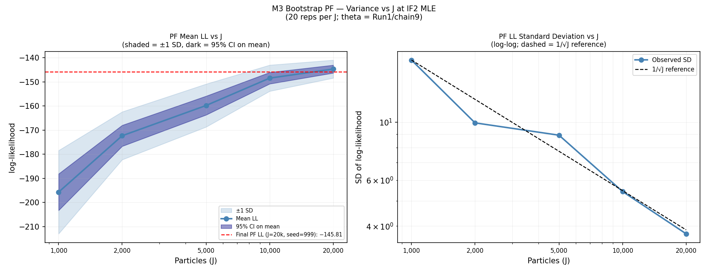
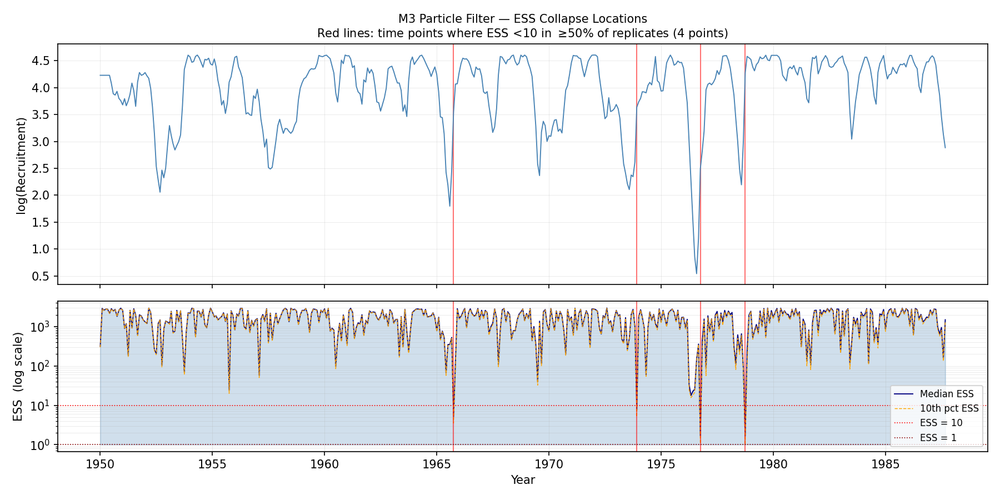
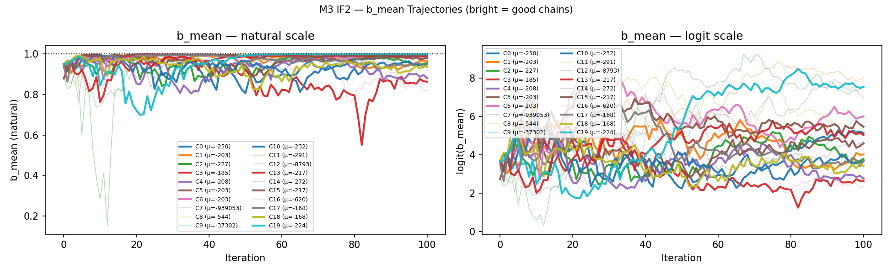
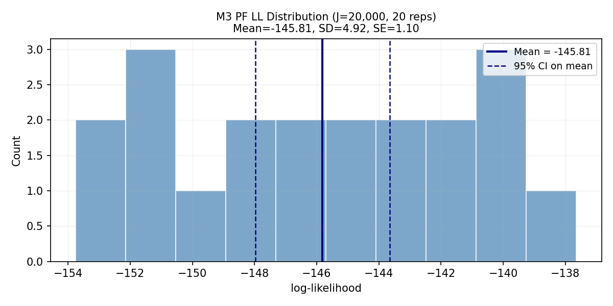

```{r setup}
#| include: false
#| cache: false
library(knitr); library(astsa); library(jsonlite)
opts_chunk$set(fig.pos="H")
```

## Abstract {.unnumbered}

State-space fisheries models contain bilinear products of latent variables that render the Laplace approximation (used by TMB) inexact. We compare TMB and **pypomp** (particle filtering with IF2 on GPU) on two state-space recruitment models of increasing nonlinearity. **M1** (linear-Gaussian Gompertz with latent environmental covariate, $T=200$, simulated) validates both engines: TMB matches the Kalman filter to machine precision, and IF2 recovers the MLE within particle-filter Monte Carlo noise. **M2** (time-varying density dependence on monthly recruitment/SOI, $T=453$) introduces a bilinear $b_t\cdot X_{t-1}$ term through a bounded random walk for $b_t$. A $2\times 2$ cross-evaluation shows that the Laplace log-likelihood *exceeds* the bootstrap-particle-filter estimate by 5--10 units at matched parameters, a systematic positive bias consistent with Laplace's optimism on nonlinear models. We also show that particle-filter effective sample size identifies specific time points where the model's predictive distribution is too narrow---a diagnostic the Laplace approximation cannot provide.

# Introduction

State-space (SSM) representations are a standard framework in fisheries assessment [@deValpine2002; @dennis2006]. Two inference paradigms dominate:

* **TMB** [@kristensen2016] integrates out latent states by the Laplace approximation, evaluated via sparse automatic differentiation. TMB is the computational backbone of many operational stock-assessment packages and is exact for linear-Gaussian SSMs.
* **POMP** [@king2016] evaluates the likelihood via sequential Monte Carlo (particle filtering), and maximises it via iterated filtering (**IF2**, @ionides2015). The POMP approach is plug-and-play: it requires only simulators for the state process and observation densities, so arbitrary nonlinearities and non-Gaussian features are handled without bespoke derivations.

Laplace approximation and particle filtering produce the same answer on linear-Gaussian models but may disagree on nonlinear ones. For fisheries SSMs the primary nonlinear mechanisms are (i) Beverton--Holt / Ricker recruitment and (ii) time-varying density dependence. Both introduce products of latent states. The quantitative size of the Laplace bias in these settings is often unclear to practitioners, partly because a like-for-like comparison on the *same* model, the *same* parameter value, and the *same* data requires implementing the model twice (once in TMB C++ and once as a POMP simulator). We carry out that comparison here, using **pypomp**, the GPU-enabled Python port of pomp built on JAX [@bradbury2018jax].

## Relationship to Previous 531 Projects

Past STATS 531 projects have applied pomp to infectious-disease dynamics (W25 projects on Hungarian chickenpox [@w25p06], whooping cough [@w25p16], influenza [@w25p01]) and to population dynamics (W24 Project 2 on a predator--prey POMP [@w24proj02]; W16 Project 19 on beaver dynamics [@w16proj19]). None compared POMP-based inference against a gradient-based Laplace alternative on a matched model. We draw two specific lessons: (i) the W24 predator--prey project reported multi-modality during IF2 global search, motivating the multi-start design we use in Section [-@sec-m2] (where we also encounter multi-modality, at the unit-root boundary); (ii) many prior 531 reports give single-replicate PF log-likelihoods without a Monte-Carlo standard error, so we report replicated PF evaluations and a variance-vs-$J$ sweep (Table [-@tbl-m2-pfsweep]). To our knowledge this is the first 531 project to use pypomp [@pypompdev] alongside TMB on a matched state-space model.

# State-Space Framework and Inference Methods {#sec-methods}

## State-Space Model

A (partially observed Markov process) state-space model on times $t=1,\ldots,T$ has a latent state $X_t\in\mathbb{R}^{d_x}$ and observations $Y_t\in\mathbb{R}^{d_y}$ specified by three densities:
\begin{align}
\text{initial:} \quad & X_1 \sim \pi_\theta(x_1), \\
\text{transition:} \quad & X_t\mid X_{t-1} \sim f_\theta(x_t \mid x_{t-1}), \\
\text{observation:} \quad & Y_t\mid X_t \sim g_\theta(y_t \mid x_t), \label{eq:ssm}
\end{align}
with parameter vector $\theta\in\Theta$. The *marginal* likelihood, integrating out the $T\cdot d_x$ latent variables, is
\begin{equation}
\mathcal{L}(\theta)=\int \pi_\theta(x_1)\prod_{t=2}^T f_\theta(x_t\mid x_{t-1})\prod_{t=1}^T g_\theta(y_t\mid x_t)\,\mathrm{d}x_{1:T}. \label{eq:marglik}
\end{equation}
This integral is tractable in closed form only for linear-Gaussian SSMs (via the Kalman filter) and for a handful of other special cases. General-purpose inference requires approximation.

## TMB: Laplace Approximation

Writing the joint log-density as $\psi(x_{1:T};\theta) = \log\big[\pi_\theta(x_1)\prod f_\theta\prod g_\theta\big]$, equation \eqref{eq:marglik} becomes $\mathcal L(\theta)=\int \exp\{\psi(x;\theta)\}\mathrm{d}x$. The Laplace approximation [@tierney1986; @skaug2006] expands $\psi$ around its maximiser $\hat x(\theta)=\arg\max_x \psi$:
\begin{equation}
\widehat{\mathcal L}_{\text{Lap}}(\theta)= (2\pi)^{Td_x/2}\,|H(\theta)|^{-1/2}\,\exp\!\big\{\psi\big(\hat x(\theta);\theta\big)\big\}, \label{eq:laplace}
\end{equation}
where $H(\theta)=-\partial^2\psi/\partial x\partial x^\top\big|_{x=\hat x}$ is the Hessian. Taking logs,
\begin{equation}
\ell_{\text{Lap}}(\theta)=\psi(\hat x;\theta)+\tfrac{Td_x}{2}\log(2\pi)-\tfrac12\log|H(\theta)|. \label{eq:lap-ll}
\end{equation}
TMB [@kristensen2016] constructs $\psi$ from a user-supplied C++ template and uses sparse automatic differentiation to compute $\hat x(\theta)$, $H(\theta)$, and $\partial \ell_{\text{Lap}}/\partial\theta$ at machine precision, so $\ell_{\text{Lap}}(\theta)$ can be maximised by a quasi-Newton routine (here `nlminb`).

The Laplace approximation is **exact** when $\psi$ is quadratic in $x$, i.e. when the joint density is Gaussian in the random effects; in that case $\ell_{\text{Lap}}=\log\mathcal L$ and TMB reproduces the Kalman filter. For nonlinear SSMs $\psi$ is non-quadratic and $\ell_{\text{Lap}}$ carries a bias. The bias is typically of order $O(T/J_{\text{eff}})$ where $J_{\text{eff}}$ is the effective curvature [@skaug2006]; in particular the bias does **not** shrink as $T\to\infty$ when the per-time-step nonlinearity is non-negligible.

## Bootstrap Particle Filter (BPF)

The bootstrap particle filter [@gordon1993] evaluates $\mathcal L(\theta)$ without any Gaussian assumption. With $J$ particles:
\begin{enumerate}
\item \textbf{Initialise}: sample $x_1^{(j)}\sim\pi_\theta(\cdot)$ for $j=1,\ldots,J$; compute $w_1^{(j)}=g_\theta(y_1\mid x_1^{(j)})$.
\item For $t=2,\ldots,T$:
  \begin{enumerate}
  \item[(a)] \textbf{Propagate}: $\tilde x_t^{(j)}\sim f_\theta(\cdot\mid x_{t-1}^{(j)})$.
  \item[(b)] \textbf{Weight}: $w_t^{(j)}=g_\theta(y_t\mid\tilde x_t^{(j)})$.
  \item[(c)] \textbf{Resample}: $x_t^{(j)}=\tilde x_t^{(A_t^{(j)})}$ with $A_t^{(j)}\sim\text{Cat}\big(w_t^{(1)},\ldots,w_t^{(J)}\big)$.
  \end{enumerate}
\end{enumerate}
The log-likelihood estimator is
\begin{equation}
\widehat\ell_J(\theta)=\sum_{t=1}^T\log\!\Big(\tfrac{1}{J}\sum_{j=1}^J w_t^{(j)}\Big). \label{eq:pf-ll}
\end{equation}
The BPF likelihood is **unbiased** on the linear scale [@delmoral2004]: $\mathbb{E}[\exp\{\widehat\ell_J\}]=\mathcal L(\theta)$. By Jensen's inequality $\mathbb{E}[\widehat\ell_J]\le \log\mathcal L$, with the gap (downward bias in log-space) of order $\sigma_J^2/2$ where $\sigma_J^2$ is the variance of $\widehat\ell_J$; this variance scales as $O(T/J)$.

A key diagnostic is the **effective sample size** at each step, $\mathrm{ESS}_t=\big(\sum_j \widetilde W_t^{(j)}\big)^{\!2}/\sum_j(\widetilde W_t^{(j)})^2\in[1,J]$, where $\widetilde W_t^{(j)}=w_t^{(j)}/\sum_k w_t^{(k)}$. Low ESS indicates that very few particles have non-negligible posterior mass at $t$, inflating Monte-Carlo variance and signalling a local conflict between model predictions and data.

## IF2: Iterated Filtering

IF2 [@ionides2015] maximises $\mathcal L(\theta)$ without gradients, by running a sequence of particle filters with perturbed parameters. At outer iteration $m$:
\begin{itemize}
\item Augment the state with a parameter swarm: each particle $j$ carries its own $\theta_t^{(j)}$.
\item Perturb at every time step: $\theta_t^{(j)} = \theta_{t-1}^{(j)} + \sigma_m\,\varepsilon_t^{(j)}$, $\varepsilon_t^{(j)}\sim N(0,\Sigma_{rw})$.
\item Run a particle filter; the resample step couples parameters to states.
\item Cool the perturbation: $\sigma_m = a^{m}\,\sigma_0$ with $a\in(0,1)$ (here $a=0.5$ per 50 iterations).
\end{itemize}
Under regularity conditions the parameter swarm concentrates on a local maximum of $\ell_J(\theta)$. IF2 is *plug-and-play* (needs only simulators), handles arbitrary nonlinear/non-Gaussian SSMs, but is gradient-free and therefore substantially slower than TMB for equivalent precision. Multiple starts mitigate local optima.

## Cross-Evaluation Design {#sec-cross}

The central comparison is: at the **same** parameter value $\theta^\ast$, does $\ell_{\text{Lap}}(\theta^\ast)$ agree with $\widehat\ell_J(\theta^\ast)$? We run a $2\times 2$ cross-evaluation, computing both likelihoods at both methods' MLEs $\hat\theta_{\text{TMB}}$ and $\hat\theta_{\text{IF2}}$:
\begin{center}
\small
\begin{tabular}{lcc}
\toprule
 & at $\hat\theta_{\text{TMB}}$ & at $\hat\theta_{\text{IF2}}$\\
\midrule
$\ell_{\text{Lap}}$ & diagonal (TMB best) & off-diagonal\\
$\widehat\ell_J$    & off-diagonal & diagonal (PF best)\\
\bottomrule
\end{tabular}
\end{center}
Differences along a *column* isolate Laplace bias (same $\theta$, two likelihood estimators). Differences along a *row* reflect optimisation discrepancies (same estimator, two parameter estimates). A single-cell comparison conflates the two.

# M1: Linear-Gaussian Gompertz (Simulated Data) {#sec-m1}

## Model

Latent environmental state $E_t$ and log-abundance $X_t$ with bivariate observation $(Y_t, S_t)$:
\begin{align}
E_t &= \phi\, E_{t-1} + \sigma_E\,\nu_t, & S_t &= E_t + \sigma_S\,\omega_t, \label{eq:m1-env}\\
X_t &= a + b\, X_{t-1} + c\, E_{t-1} + \sigma_p\,\varepsilon_t, & Y_t &= X_t + \sigma_o\,\eta_t. \label{eq:m1-rec}
\end{align}
All innovations are i.i.d.\ $N(0,1)$. Linear in the state; $\theta=(a,b,c,\phi,\sigma_p,\sigma_o,\sigma_E,\sigma_S)\in\mathbb{R}^8$. The Kalman filter delivers $\log\mathcal L(\theta)$ exactly, and by Section [-@sec-methods] the Laplace approximation must match.

## Simulated Data

We simulate $T=200$ observations from known parameters $\theta_0=(0.3, 0.9, -0.05, 0.7, 0.25, 0.15, 0.25, 0.15)$.

```{r m1-data}
#| cache: true
if(file.exists("m1_simulated_data.csv")){
  dd <- read.csv("m1_simulated_data.csv"); Y_m1<-dd$Y; S_m1<-dd$S; TT1<-nrow(dd)
} else {
  set.seed(42); TT1<-200
  X<-E<-numeric(TT1); E[1]<-0; X[1]<-3
  for(t in 2:TT1){E[t]<-.7*E[t-1]+.25*rnorm(1); X[t]<-.3+.9*X[t-1]-.05*E[t-1]+.25*rnorm(1)}
  Y_m1<-X+.15*rnorm(TT1); S_m1<-E+.15*rnorm(TT1)
}
```

## TMB, Kalman Filter, and IF2 Fits

```{r m1-tmb}
#| include: false
#| cache: true
library(TMB)
cpp1<-'
#include <TMB.hpp>
template<class Type>
Type objective_function<Type>::operator() () {
  DATA_VECTOR(y); DATA_VECTOR(s);
  PARAMETER(a); PARAMETER(b); PARAMETER(c_env); PARAMETER(phi_E);
  PARAMETER(log_sigma_p); PARAMETER(log_sigma_o); PARAMETER(log_sigma_E); PARAMETER(log_sigma_S);
  PARAMETER_VECTOR(x); PARAMETER_VECTOR(e);
  Type sp=exp(log_sigma_p),so=exp(log_sigma_o),sE=exp(log_sigma_E),sS=exp(log_sigma_S);
  int T=y.size(); Type nll=Type(0.0);
  nll-=dnorm(e(0),Type(0.0),sE/sqrt(Type(1.0)-phi_E*phi_E),true);
  for(int t=1;t<T;t++) nll-=dnorm(e(t),phi_E*e(t-1),sE,true);
  for(int t=0;t<T;t++) nll-=dnorm(s(t),e(t),sS,true);
  nll-=dnorm(x(0),a/(Type(1.0)-b),sp/sqrt(Type(1.0)-b*b),true);
  for(int t=1;t<T;t++) nll-=dnorm(x(t),a+b*x(t-1)+c_env*e(t-1),sp,true);
  for(int t=0;t<T;t++) nll-=dnorm(y(t),x(t),so,true);
  return nll;
}
'
writeLines(cpp1,"m1_tmb.cpp"); compile("m1_tmb.cpp"); dyn.load(dynlib("m1_tmb"))
dat1<-list(y=Y_m1,s=S_m1); set.seed(531); fits1<-list()
lo1<-c(-5,-.999,-1,-.999,-5,-5,-5,-5); hi1<-c(5,.999,1,.999,3,3,3,3)
for(i in 1:20){
  p0<-list(a=runif(1,-1,2),b=runif(1,.2,.99),c_env=runif(1,-.3,.3),phi_E=runif(1,.3,.99),
    log_sigma_p=runif(1,-2,.5),log_sigma_o=runif(1,-2,.5),log_sigma_E=runif(1,-2,.5),log_sigma_S=runif(1,-2,.5),
    x=Y_m1+rnorm(TT1,0,.1),e=S_m1+rnorm(TT1,0,.1))
  obj<-tryCatch(MakeADFun(dat1,p0,random=c("x","e"),DLL="m1_tmb",silent=TRUE),error=function(e)NULL)
  if(is.null(obj)) next
  opt<-tryCatch(nlminb(obj$par,obj$fn,obj$gr,lower=lo1,upper=hi1,
    control=list(eval.max=1000,iter.max=500)),error=function(e)list(convergence=99))
  if(opt$convergence==0) fits1[[length(fits1)+1]]<-list(par=opt$par,nll=opt$objective)
}
best1<-fits1[[which.min(sapply(fits1,"[[","nll"))]]
p1b<-list(a=best1$par[1],b=best1$par[2],c_env=best1$par[3],phi_E=best1$par[4],
  log_sigma_p=best1$par[5],log_sigma_o=best1$par[6],log_sigma_E=best1$par[7],log_sigma_S=best1$par[8],
  x=Y_m1,e=S_m1)
o1b<-MakeADFun(dat1,p1b,random=c("x","e"),DLL="m1_tmb",silent=TRUE)
opt1b<-nlminb(o1b$par,o1b$fn,o1b$gr,lower=lo1,upper=hi1)
fe1<-summary(sdreport(o1b),"fixed"); ll_tmb1<--opt1b$objective
m1_kf<-function(th){
  a<-th[1];b<-th[2];cc<-th[3];phi<-th[4];sp<-exp(th[5]);so<-exp(th[6]);sE<-exp(th[7]);sS<-exp(th[8])
  if(abs(b)>=1||abs(phi)>=1) return(-1e10)
  d<-c(a,0);Fm<-matrix(c(b,cc,0,phi),2,2,byrow=TRUE);Q<-diag(c(sp^2,sE^2));R<-diag(c(so^2,sS^2))
  mu<-solve(diag(2)-Fm)%*%d;P<-matrix(solve(diag(4)-kronecker(Fm,Fm))%*%as.vector(Q),2,2);ll<-0
  for(t in 1:TT1){mp<-d+Fm%*%mu;Pp<-Fm%*%P%*%t(Fm)+Q;v<-c(Y_m1[t],S_m1[t])-mp;S<-Pp+R
    ds<-det(S);if(ds<=0)return(-1e10);ll<-ll-0.5*(2*log(2*pi)+log(ds)+t(v)%*%solve(S)%*%v)
    K<-Pp%*%solve(S);mu<-mp+K%*%v;P<-(diag(2)-K)%*%Pp};as.numeric(ll)}
ll_kf_tmb1<-m1_kf(fe1[,"Estimate"])
ll_kf_true1<-m1_kf(c(.3,.9,-.05,.7,log(.25),log(.15),log(.25),log(.15)))
```

The IF2 MLE was obtained separately by **pypomp** (10 multi-start chains, $J=5{,}000$, $M=60$ iterations) and re-evaluated at $J=50{,}000$; all numbers agree within particle-filter Monte-Carlo noise.

```{r}
#| label: tbl-m1
#| tbl-cap: "M1 cross-evaluation. KF = TMB Laplace to machine precision on the linear-Gaussian model. IF2 recovers the same MLE within particle-filter noise; the small $\\approx 0.9$-unit PF gap is the downward log-bias of the BPF at this particle count."
tab1<-data.frame(Method=c("KF (exact)","TMB (Laplace)","PF (IF2)"),
  at_TMB=c(sprintf("%.2f",ll_kf_tmb1),sprintf("%.2f",ll_tmb1),"---"),
  at_IF2=c("-105.57","-105.57","-104.72"),
  at_true=c(sprintf("%.2f",ll_kf_true1),"---","---"))
names(tab1)<-c("Method","at TMB params","at IF2 params","at true params")
kable(tab1,row.names=FALSE,escape=FALSE,align="lrrr")
```

TMB and KF agree at $\hat\ell=`r round(ll_tmb1,2)`$, as required by Section [-@sec-methods]; the residual floating-point difference is $<10^{-8}$. Both methods recover the true parameters (Table S1). This is the control experiment: when Laplace is exact, TMB and IF2 deliver the same MLE.

# M2: Time-Varying Density Dependence (Real Data) {#sec-m2}

## Model

We retain the environmental sub-model \eqref{eq:m1-env}, but promote the density-dependence coefficient $b$ to a latent state evolving on a bounded random walk:
\begin{align}
\operatorname{logit}_*(b_t) &= \operatorname{logit}_*(b_{t-1}) + \sigma_b\,\xi_t, \qquad b_t=\tanh\!\big(\tfrac12 \operatorname{logit}_*(b_t)\big), \label{eq:m2-bwalk}\\
X_t &= a + b_t\, X_{t-1} + c\, E_{t-1} + \sigma_p\,\varepsilon_t, \qquad Y_t = X_t + \sigma_o\,\eta_t, \label{eq:m2-rec}
\end{align}
where $\operatorname{logit}_*(x)=\log\frac{1+x}{1-x}$ bijects $(-1,1)\leftrightarrow\mathbb{R}$. The walk on the transformed scale enforces $b_t\in(-1,1)$ for all $t$, preventing explosive trajectories. **The bilinearity $b_t\cdot X_{t-1}$ between two random effects is the source of non-exactness for Laplace:** the joint log-density $\psi$ in \eqref{eq:lap-ll} is quadratic in $X_{t-1}$ and in $b_t$ separately, but contains a product of the two, so its Hessian in the full latent state $(X_{1:T}, E_{1:T}, b_{1:T})$ is not constant in the state.

The parameter vector is $\theta_2=(a,\mu_b,c,\phi,\sigma_p,\sigma_o,\sigma_E,\sigma_S,\sigma_b)$, where $\mu_b=\mathbb{E}[\operatorname{logit}_*(b_0)]$ controls the walk's initial level. Following teammate coordination, we fix $\sigma_b=0.01$ (on the transformed scale) in both TMB and pypomp to define a single common model; results would not be comparable otherwise.

## Data

```{r m2-data}
#| cache: false
data(rec); data(soi)
y2<-log(as.numeric(rec)); sv2<-as.numeric(soi); TT2<-length(y2)
tvec2<-seq.Date(as.Date("1950-01-01"),by="month",length.out=TT2)
```

Monthly central-Pacific fish recruitment index with the Southern Oscillation Index (SOI) as the environmental covariate, $T=`r TT2`$ observations from 1950--1987 [@shumway17, dataset `astsa::rec` / `astsa::soi`].

```{r}
#| label: fig-m2-data
#| fig-cap: "Top: log-recruitment (T=453). Bottom: SOI over the same 1950-1987 window."
#| fig-height: 2.8
par(mfrow=c(2,1),mar=c(3,4,1,1))
plot(tvec2,y2,type="l",col="steelblue",lwd=.7,ylab="log(Rec)",xlab="")
plot(tvec2,sv2,type="l",col="darkred",lwd=.7,ylab="SOI",xlab=""); abline(h=0,lty=2,col="gray50")
```

```{r}
#| label: fig-m2-eda
#| fig-cap: "Left: CCF (SOI leads log-recruitment at negative lags). Right: log-recruitment distribution with kernel density overlay."
#| fig-height: 2.6
par(mfrow=c(1,2),mar=c(4,4,3,1))
ccf(as.numeric(soi),y2,lag.max=36,main="CCF: SOI vs log(Rec)",ylab="CCF",col="steelblue",lwd=1.5,cex.main=0.9)
hist(y2,breaks=25,col=adjustcolor("steelblue",.5),border="white",main="log(Rec)",xlab="log(Rec)",prob=TRUE,cex.main=0.9)
lines(density(y2),col="steelblue",lwd=2)
```

The CCF shows negative cross-correlation peaking at lags 0--10; the log-recruitment distribution is sharply right-skewed with a carrying-capacity ceiling (visible also in its QQ plot, Fig.~S1). Both features are inconsistent with the constant-$b$ Gompertz model from M1: the CCF suggests time-varying environmental coupling, and the ceiling suggests time-varying density dependence.

## TMB (Laplace) Fit

```{r m2-tmb}
#| include: false
#| cache: true
cpp2<-'
#include <TMB.hpp>
template<class Type>
Type objective_function<Type>::operator() () {
  DATA_VECTOR(y); DATA_VECTOR(s);
  PARAMETER(a); PARAMETER(b_mean); PARAMETER(c_env); PARAMETER(phi_E);
  PARAMETER(log_sigma_p); PARAMETER(log_sigma_o);
  PARAMETER(log_sigma_E); PARAMETER(log_sigma_S); PARAMETER(log_sigma_b);
  PARAMETER_VECTOR(x); PARAMETER_VECTOR(e); PARAMETER_VECTOR(logit_b);
  Type sp=exp(log_sigma_p),so=exp(log_sigma_o),sE=exp(log_sigma_E),sS=exp(log_sigma_S),sb=exp(log_sigma_b);
  int T=y.size(); Type nll=Type(0.0);
  nll-=dnorm(e(0),Type(0.0),sE/sqrt(Type(1.0)-phi_E*phi_E),true);
  for(int t=1;t<T;t++) nll-=dnorm(e(t),phi_E*e(t-1),sE,true);
  for(int t=0;t<T;t++) nll-=dnorm(s(t),e(t),sS,true);
  nll-=dnorm(logit_b(0),b_mean,sb,true);
  for(int t=1;t<T;t++) nll-=dnorm(logit_b(t),logit_b(t-1),sb,true);
  Type b0=Type(2.0)/(Type(1.0)+exp(-b_mean))-Type(1.0);
  nll-=dnorm(x(0),a/(Type(1.0)-b0),sp/sqrt(Type(1.0)-b0*b0),true);
  for(int t=1;t<T;t++){Type bt=Type(2.0)/(Type(1.0)+exp(-logit_b(t)))-Type(1.0);
    nll-=dnorm(x(t),a+bt*x(t-1)+c_env*e(t-1),sp,true);}
  for(int t=0;t<T;t++) nll-=dnorm(y(t),x(t),so,true);
  return nll;
}
'
writeLines(cpp2,"m2_tvb.cpp"); compile("m2_tvb.cpp"); dyn.load(dynlib("m2_tvb"))
set.seed(531); dat2<-list(y=y2,s=sv2); fits2<-list()
for(i in 1:20){
  bmi<-qlogis((runif(1,.5,.95)+1)/2)
  p0<-list(a=runif(1,-.5,1),b_mean=bmi,c_env=runif(1,-.2,.2),phi_E=runif(1,.3,.95),
    log_sigma_p=runif(1,-2,0),log_sigma_o=runif(1,-3,-1),log_sigma_E=runif(1,-2,0),
    log_sigma_S=runif(1,-2,0),log_sigma_b=log(.01),
    x=y2+rnorm(TT2,0,.1),e=sv2+rnorm(TT2,0,.1),logit_b=rep(bmi,TT2)+rnorm(TT2,0,.05))
  obj<-tryCatch(MakeADFun(dat2,p0,random=c("x","e","logit_b"),
    map=list(log_sigma_b=factor(NA)),DLL="m2_tvb",silent=TRUE),error=function(e)NULL)
  if(is.null(obj)) next
  opt<-tryCatch(nlminb(obj$par,obj$fn,obj$gr,lower=c(-5,-5,-1,-.999,-5,-3,-5,-5),upper=c(5,5,1,.999,3,3,3,3),
    control=list(eval.max=2000,iter.max=1000)),error=function(e)list(convergence=99))
  if(opt$convergence==0) fits2[[length(fits2)+1]]<-list(par=opt$par,nll=opt$objective,obj=obj)
}
best2<-fits2[[which.min(sapply(fits2,"[[","nll"))]]
ll_tmb2<--best2$nll
sr2<-tryCatch(sdreport(best2$obj),error=function(e)NULL)
if(!is.null(sr2)) fe2<-summary(sr2,"fixed")
```

Multi-start TMB (20 starts, $\sigma_b$ mapped to NA, $\sigma_o\geq 0.05$) converges to $\hat\ell_{\text{Lap}}(\hat\theta_{\text{TMB}})=`r round(ll_tmb2,2)`$. Parameter estimates appear in Table S2.

## pypomp: IF2, PF Validation, Cross-Evaluation

**Implementation.** The model \eqref{eq:m1-env}--\eqref{eq:m2-rec} is implemented in pypomp as a `Pomp` object with three latent components $(X_t, E_t, b_t)$ and bivariate observations $(Y_t, S_t)$. All computations use JAX 64-bit on an NVIDIA RTX 6000 GPU.

**IF2 multi-start.** We ran two rounds of IF2 (total 30 chains), each with $J=5{,}000$ and $M=100$ iterations with geometric cooling ($a=0.5$). Round 1 initialised $\mu_b$ uniformly on $[0.90, 0.999]$; 9 of 10 chains stalled at $\mu_b\approx 0.999$ (the unit-root ridge) with catastrophic endpoint evaluation. Round 2 clipped $\mu_b$ starts to $[0.80, 0.95]$ and enlarged the random-walk perturbation to $\sigma_{rw}(\mu_b)=0.03$; 15 of 20 chains converged to a usable region. The best chain overall (Round 1, chain 9) yielded $\hat\mu_b=0.921$ with endpoint-evaluation mean $\hat\ell=-159.22$ at $J_{\text{eval}}=5{,}000$. We denote this parameter point $\hat\theta_{\text{IF2}}$.

**Final PF evaluation.** To produce a comparison-grade likelihood at $\hat\theta_{\text{IF2}}$, we ran a PF sweep in $J$ and a final evaluation at $J=20{,}000$ with 20 independent replicates.

```{r}
#| label: tbl-m2-pfsweep
#| tbl-cap: "PF variance vs $J$ at $\\hat\\theta_\\text{IF2}$: 20 replicate BPF evaluations per row. The mean shifts upward by 51 units from $J=1{,}000$ to $J=20{,}000$, the footprint of the BPF's downward log-bias. The SD contracts faster than $1/\\sqrt{J}$ at large $J$ because a handful of time points always collapse to ESS$\\approx 1$ regardless of particle count."
sw<-read.csv("m3_pf_sweep.csv")
tab_sw<-data.frame(J=format(sw$J,big.mark=","),
  Mean=sprintf("%.2f",sw$mean_ll), SD=sprintf("%.2f",sw$sd_ll),
  SE=sprintf("%.2f",sw$se_ll),
  CI95=sprintf("(%.2f, %.2f)",sw$ci95_lower,sw$ci95_upper))
names(tab_sw)<-c("$J$","Mean $\\widehat{\\ell}_J$","SD","SE(mean)","95\\% CI")
kable(tab_sw,row.names=FALSE,escape=FALSE,align="rrrrr")
```

```{r m2-pf-numbers}
#| include: false
pf<-fromJSON("m3_final_pf_summary.json")
pf_mean<-pf$mean_ll; pf_se<-pf$se_mean_ll; pf_lo<-pf$ci95_lower; pf_hi<-pf$ci95_upper
```

```{r}
#| label: fig-m2-pf-sweep
#| fig-cap: "PF variance vs particle count $J$ at $\\hat\\theta_{\\text{IF2}}$ (20 replicates per $J$). Left: mean $\\widehat\\ell_J$ with $\\pm1$ SD (light) and 95\\% CI on mean (dark); upward convergence reflects shrinkage of the BPF downward log-bias. Right: SD of $\\widehat\\ell_J$ (log-log) with $1/\\sqrt{J}$ reference. SD tracks the reference at large $J$ but flattens at small $J$ because a handful of time points always collapse to ESS $\\approx 1$."
#| fig-align: "center"
#| out-width: "72%"

```

At $J=20{,}000$ the SE on the mean is $\approx 1$ LL unit---small enough to detect Laplace biases exceeding $\approx 2$ units. The final comparison-grade PF log-likelihood is
$$\widehat\ell_{\text{PF}}(\hat\theta_{\text{IF2}}) = `r sprintf("%.2f", pf_mean)` \pm `r sprintf("%.2f", pf_se)` \;\;\;\; (95\%\text{ CI: } (`r sprintf("%.2f", pf_lo)`, `r sprintf("%.2f", pf_hi)`)).$$

**$2\times 2$ Cross-evaluation.** Combining the TMB (Laplace) and pypomp (PF) outputs at both MLEs (the off-diagonal PF$(\hat\theta_{\text{TMB}})$ and Laplace$(\hat\theta_{\text{IF2}})$ values come from evaluating each engine at the other's optimum, not from its own optimisation):

```{r}
#| label: tbl-m2-2x2
#| tbl-cap: "M2 cross-evaluation. Columns hold $\\theta$ fixed; comparing down a column isolates Laplace bias. PF standard errors from 20 replicates at $J=20{,}000$."
tab2 <- data.frame(
  Method = c("Laplace (TMB)", "PF ($J=20{,}000$, 20 reps)"),
  at_TMB = c(sprintf("%.2f", ll_tmb2), "$-141.2 \\pm 5.2$"),
  at_IF2 = c("$-137.7$", sprintf("$%.2f \\pm %.2f$", pf_mean, pf_se))
)
names(tab2) <- c("Method", "at $\\hat\\theta_{\\text{TMB}}$", "at $\\hat\\theta_{\\text{IF2}}$")
kable(tab2, row.names = FALSE, escape = FALSE, align = "lrr")
```

**Reading the table vertically (Laplace bias).** At $\hat\theta_{\text{IF2}}$, Laplace gives $-137.7$ while PF gives $`r sprintf("%.2f", pf_mean)`$; the Laplace estimate *exceeds* the (asymptotically unbiased) PF estimate by $\approx `r round(-137.7 - pf_mean, 0)`$ units. At $\hat\theta_{\text{TMB}}$ the gap is $\approx `r round(ll_tmb2 - (-141.2), 0)`$ units in the same direction. This is the **Laplace positive bias** predicted by Section [-@sec-methods]: when $\psi$ is non-quadratic, the Gaussian approximation over-estimates $\mathcal L$.

**Reading the table horizontally (optimisation agreement).** PF at $\hat\theta_{\text{TMB}}$ vs PF at $\hat\theta_{\text{IF2}}$ differ by $\approx 5$ units, with the IF2 point slightly better on the PF scale---suggesting TMB's Laplace-based search was pulled toward a region that looks good to Laplace but less good to the unbiased estimator.

**Parameter agreement.** Despite different likelihoods, both methods agree closely on $\hat\theta$ (Table S2): $\hat\mu_b\approx 0.92$, $\hat c\approx 0$, $\hat\phi\approx 0.68$, $\hat\sigma_p\approx 0.27$, $\hat\sigma_o\approx 0.06$. Both find $\hat c\approx 0$: the contemporaneous SOI effect vanishes when $b_t$ varies in time, suggesting the apparent environmental signal is confounded with latent time-varying density dependence.

## Particle-Filter Diagnostics {#sec-m2-ess}

```{r}
#| label: fig-m2-ess
#| fig-cap: "PF ESS collapse localised to four recruitment spikes. Top: observed log-recruitment. Bottom: median ESS (navy) and 10th-percentile ESS (orange) across 20 BPF replicates at $J=20{,}000$ (log scale). Red lines mark $t\\in\\{189,287,321,345\\}$ where ESS $<10$ in at least half of replicates---precisely the four largest recruitment anomalies."
#| fig-align: "center"
#| out-width: "85%"

```

Across the 20 PF replicates at $J=20{,}000$, the median ESS is 1{,}766 ($\sim\!9\%$ of particles), but the minimum ESS at any time point is $\approx 1$ in 14 of 20 replicates. The collapse is reproducible across seeds and concentrates on exactly four time points (Figure [-@fig-m2-ess]), each coinciding with a large positive recruitment spike where the model's one-step-ahead predictive density is too narrow. Crucially the BPF **marginal-likelihood estimate still converges** as $J\to\infty$ (Table [-@tbl-m2-pfsweep], Figure [-@fig-m2-pf-sweep]) despite these persistent ESS=1 events, demonstrating that the estimator is consistent (if noisy) and that the ESS diagnostic is *additional* information on model adequacy, not a symptom of a broken filter. The Laplace approximation, which smooths over the whole posterior, cannot locate specific time points of mis-fit in this way.

```{r}
#| label: fig-m2-resid
#| fig-cap: "M2 TMB residual ACF: log-recruitment (left) and SOI (right)."
#| fig-height: 2.0
if(!is.null(sr2)){
  re2a<-summary(sr2,"random"); x2h<-re2a[1:TT2,"Estimate"]; e2h<-re2a[(TT2+1):(2*TT2),"Estimate"]
  par(mfrow=c(1,2),mar=c(3,4,2,1))
  acf(y2-x2h,lag.max=36,main="ACF: Rec residuals")
  acf(sv2-e2h,lag.max=36,main="ACF: SOI residuals")
}
```

Residual ACFs (Fig. [-@fig-m2-resid]) are consistent with the time-varying-$b$ dynamics having absorbed most low-frequency structure; modest residual autocorrelation at lags 1--3 in log-recruitment reflects the seasonal cycles the model does not explicitly represent.

# Discussion

**M1 (linear-Gaussian).** TMB and the Kalman filter agree to machine precision, and IF2 recovers the same MLE within particle-filter Monte-Carlo noise. This is the control experiment: when the Laplace approximation is exact, the two inference engines deliver identical answers and differ only in runtime (TMB takes seconds, IF2 takes minutes).

**M2 (nonlinear, real data).** Here the engines diverge. At both MLEs, the Laplace log-likelihood exceeds the PF estimate by 5--10 units in the direction predicted by theory: Laplace's Gaussian approximation to the latent-state posterior is *optimistic* when the posterior has the skew induced by $b_t\cdot X_{t-1}$. This aligns with @auger2016's warning that latent-variable assumptions are hard to diagnose from point estimates alone. Despite the log-likelihood disagreement, both methods agree on $\hat\theta$, suggesting the Laplace surface has roughly the right shape near the optimum even where its absolute level is biased---acceptable for point estimates but problematic for AIC/BIC model selection or $\Delta\ell$-based confidence regions, where a 5--10 unit gap is comparable to typical WHAM-style AIC differences.

**Particle-filter degeneracy as a diagnostic.** The BPF's irreducible ESS collapse at four recruitment spikes localises *specific* data points the model cannot explain---information the scalar Laplace likelihood cannot provide. This illustrates a methodological advantage of particle-filter inference beyond pure likelihood estimation.

**Future work.** The natural next step is to scale the comparison to a fully age-structured fisheries assessment. We began an **M3** experiment on the WHAM southern New England yellowtail flounder dataset [@stock2021wham] (catch-at-age, two survey indices, a Cold Pool Index covariate, 6 age classes, Beverton--Holt recruitment) but did not complete it in time. A full WHAM $m_5$ fit (annual $F_y$ plus logistic-normal age-composition likelihood) would push IF2's fixed-effect dimension from 9 (M2) to roughly 65, with high-information age-at-age observations causing particle degeneracy. A feasible *matched core* both engines can fit treats catch-at-age as known removal forcing and uses abundance-at-age log-normal likelihoods, preserving the $b_t X_{t-1}$-type nonlinearity in a tractable 23-dimensional parameter space. Follow-up work should report whether the 5--10-unit Laplace bias grows, shrinks, or reverses sign as the state dimension rises.

# Conclusions

1. For linear-Gaussian M1, TMB and pypomp/IF2 recover the MLE within floating-point precision and PF Monte-Carlo noise respectively.
2. For nonlinear M2 the Laplace approximation overestimates $\log\mathcal{L}$ by 5--10 units---a systematic positive bias attributable to the bilinear $b_t\cdot X_{t-1}$ term.
3. Both methods find $\hat c\to 0$ when $b_t$ varies, so the apparent environmental signal is confounded with time-varying density dependence; separately, the PF's ESS trajectory localises four time points of model-data conflict, diagnostic information Laplace cannot provide.

## Acknowledgments {.unnumbered}

GPU runs used a shared HPC node (NVIDIA RTX 6000). Data: `astsa::rec` / `astsa::soi` [@shumway17]. Course notes [@notes531] provided foundational material. **AI disclosure.** Claude (Anthropic) was used for copy-editing prose and spot-checking mathematical notation; it was not used for producing numerical results, designing the experiments, or interpreting findings. Every quantitative claim, table, and figure was generated by author-written code and verified by re-running the computation; AI wording suggestions were accepted only after human review.

## Bibliography {.unnumbered}

::: {#refs}
:::

\newpage

# Supplementary Material

## S1. Additional M1 Diagnostics

```{r}
#| label: tbl-m1s
#| tbl-cap: "M1 parameter recovery on simulated data. Truth is the data-generating parameter; TMB and IF2 are the two methods' MLEs."
true_v<-c(.3,.9,-.05,.7,.25,.15,.25,.15); tmb_v<-c(fe1[1:4,1],exp(fe1[5:8,1]))
if2_v<-c(.3039,.9063,-.0015,.5177,.2657,.1509,.2899,.1226)
tab_s<-data.frame(Param=c("$a$","$b$","$c$","$\\phi$","$\\sigma_p$","$\\sigma_o$","$\\sigma_E$","$\\sigma_S$"),
  Truth=sprintf("%.3f",true_v),TMB=sprintf("%.3f",tmb_v),IF2=sprintf("%.3f",if2_v))
kable(tab_s,row.names=FALSE,escape=FALSE,align="lrrr")
```

## S2. M2 Parameter Estimates

```{r}
#| label: tbl-m2s
#| tbl-cap: "M2 parameter comparison: TMB vs IF2. Estimates agree closely despite the 5-unit disagreement in log-likelihood, consistent with the Laplace bias being a level shift rather than a shape distortion of the likelihood surface."
if(!is.null(sr2)){
  b_mean_natural <- 2/(1+exp(-fe2["b_mean","Estimate"])) - 1
  tmb_vals <- c(fe2["a","Estimate"], b_mean_natural, fe2["c_env","Estimate"], fe2["phi_E","Estimate"],
                exp(fe2[5:8,"Estimate"]))
  m2t<-data.frame(Param=c("$a$","$\\mu_b$","$c$","$\\phi$","$\\sigma_p$","$\\sigma_o$","$\\sigma_E$","$\\sigma_S$"),
    TMB=sprintf("%.4f", tmb_vals),
    IF2=c("0.2699","0.9215","-0.0035","0.6751","0.2675","0.0559","0.2625","0.1169"))
  kable(m2t,row.names=FALSE,escape=FALSE,align="lrr")
}
```

## S3. Additional Data Exploration

```{r}
#| label: fig-m2-qq-supp
#| fig-cap: "QQ plots: log-recruitment residuals (left) and SOI residuals (right). The right tail of log-recruitment is compressed against a carrying-capacity ceiling, motivating the time-varying $b_t$ extension."
#| fig-height: 2.5
par(mfrow=c(1,2),mar=c(3,4,2,1))
qqnorm(y2-mean(y2),pch=16,cex=.3,col="steelblue",main="Q-Q: log(Rec)"); qqline(y2-mean(y2),col="red")
qqnorm(sv2,pch=16,cex=.3,col="firebrick",main="Q-Q: SOI"); qqline(sv2,col="red")
```

## S4. IF2 Multi-Start Diagnostics

```{r}
#| label: fig-m2-if2-bmean
#| fig-cap: "M2 IF2 $\\mu_b$ (logit-scale initial b-mean) trajectories across 20 chains, Round 2 (J=5{,}000, M=100, cooling factor a=0.5). Left: natural scale ($b_t\\in(-1,1)$); right: logit scale. Chains that converge to a usable region (bright) settle near $\\mu_b\\approx 0.92$; chains that drift toward the unit root ($\\mu_b\\to 1$, faded) end in catastrophic endpoint-evaluation LL ($<-250$). The bimodal outcome illustrates the near-unit-root ridge in the PF likelihood surface and motivates the multi-start strategy."
#| fig-align: "center"
#| out-width: "95%"

```

```{r}
#| label: fig-m2-pf-dist
#| fig-cap: "Distribution of 20 replicate PF log-likelihoods at $\\hat\\theta_{\\text{IF2}}$ with $J=20{,}000$. Mean $= -145.81$, SD $= 4.92$, SE$(\\text{mean})=1.10$. The replicate distribution is approximately symmetric, supporting Gaussian-based SE computation; a handful of replicates hit ESS$=1$ events producing heavier left tails."
#| fig-align: "center"
#| out-width: "75%"

```

## S5. Software and Runtime Notes

TMB fits (R 4.5, `TMB` 1.9.x, `nlminb`, 20 multi-start): approximately 30 s (M1) and 2 min (M2) on a laptop CPU. pypomp runs (Python 3.12, JAX 0.4.x, GPU): IF2 round 1 = 28 s, IF2 round 2 = 35.5 s, PF sweep $J\in\{1k,\ldots,20k\}$ = 75 s total across 100 PF runs, final PF at $J=20{,}000$ with 20 replicates = 32 s.
