```{r setup, include=FALSE}
knitr::opts_chunk$set(echo = FALSE, message = FALSE, warning = FALSE,
                      fig.align = "center", out.width = "80%")
library(knitr)
```

# Introduction {#sec-intro}

Pneumonia and influenza (P&I) remain a leading cause of death in the United States, with marked seasonality and well-documented disparities across racial groups [@cdc-wonder]. Mechanistic compartmental models such as the SEIR family are the canonical framework for infectious-disease dynamics [@keeling2008], but their likelihood-based fitting to multi-year mortality series is nontrivial because the latent state is only partially observed. We apply the iterated-filtering (IF2) machinery of @ionides2015 through the `pypomp` package [@pypomp] to race-stratified monthly P&I deaths from CDC WONDER (1999--2020) and compare to benchmark models.

**Question.** Can a seasonal SEIR partially-observed Markov process (POMP) capture the monthly P&I mortality dynamics for the U.S. White population, and how does its fit compare to purely statistical benchmarks (ARMA, SARIMA, and GARCH)?

**Contribution.** We (i) construct a pypomp SEIR representation with Bretó-style gamma environmental noise and a time-varying seasonal transmission rate, augmented with a COVID regime-shift parameter; (ii) carry out a full likelihood-based workflow (simulation study for identifiability, local and global IF2 searches, particle-filter evaluation, probe diagnostics, and profile likelihoods for two structural parameters); and (iii) place the mechanistic model in competition with ARMA, SARIMA, and GARCH benchmarks. The overall structure of our workflow deliberately follows @w21proj06, which applied a Heston stochastic-volatility POMP to GameStop returns; we replace the financial POMP with an epidemiological one appropriate for count-valued monthly mortality data.

# Data {#sec-data}

We use CDC WONDER Underlying Cause of Death data for ICD-10 codes J09--J18 (influenza and pneumonia), monthly totals for 1999-01 through 2020-12, stratified by the WONDER `Race` field [@cdc-wonder]. Our primary analysis focuses on the `White` stratum, which has the longest clean series and the largest monthly counts (mean 4126 deaths/month, SD 1371 deaths/month, $n = 264$ months). A secondary cross-race baseline comparison is reported in @sec-compare.

# Exploratory data analysis {#sec-eda}

```{r fig-eda-ts, fig.cap = "Monthly White P&I deaths (top, raw scale) along with log deaths and their differences, 1999--2020. Strong annual seasonality is visible throughout, with a clear downward mean shift in 2020 that reflects both reporting changes and COVID-era reclassification of respiratory deaths.", out.width = "60%", fig.pos = "H"}
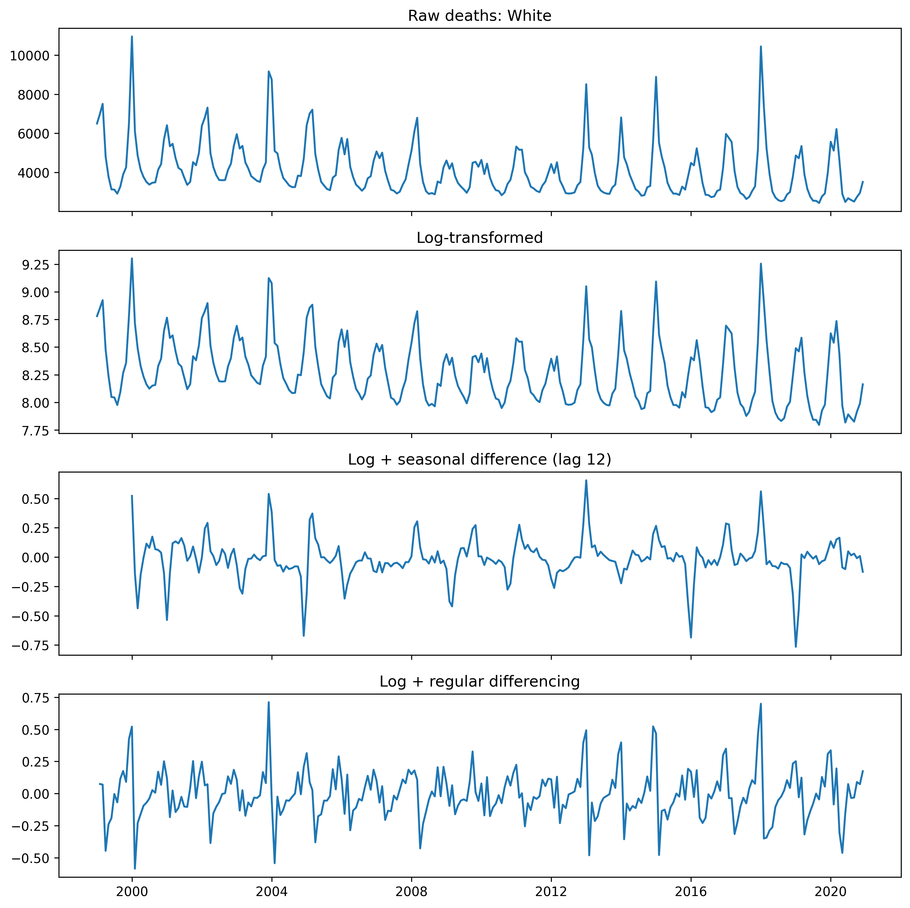
```

@fig-eda-ts shows the raw and 3 transformed versions of the series series. Three features dominate:


1. **Annual seasonality.** The ACF of log deaths at lag 12 is 0.76 , and the seasonal mean profile peaks in January--February and troughs in August--September, consistent with the North-American influenza calendar.
2. **Strong persistence.** The AR(1) coefficient on log deaths is $\hat{\phi}_1 = 0.78$ with PACF(1) = 0.78, suggesting a large autoregressive component that any reasonable model must capture.
3. **A COVID-era regime shift.** The mean monthly death count for March 2020 onward is about 0.80 times the pre-March-2020 mean --- a *decrease* rather than an increase. This counterintuitive pattern reflects the CDC reclassification of respiratory deaths to COVID-19 (U07.1) after March 2020, which mechanically removed mass from the J09--J18 codes.

The log transformation serves to stabilize variance and is a natural choice for count data. Differencing is also useful and we see that both first differencing and seasonal differencing at lag 12 reject an ADF test with p-values of $6.7\times 10^{-10}$ and $6.4\times 10^{-6}$ respectively. Looking at the ACF's of each of these transformations in @fig-data-acf we see that the seasonal difference is a much more attractive transformation  as it deals with seasonality much more effectively.

```{r fig-data-acf, fig.cap = "Autocorrelation function for the differenced log series at lag 1 and 12 ", out.width = "60%", fig.pos = "H"}
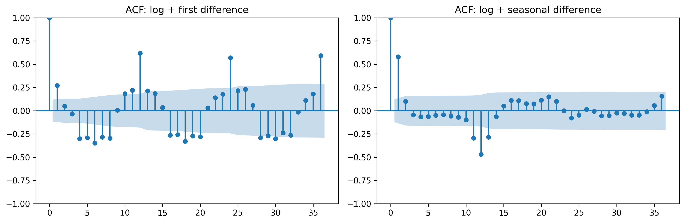
```

These three features motivate:
1. a stationary ARMA benchmark on the seasonally differenced log series
2. a SARIMA benchmark on the same series
3. a mechanistic SEIR with sinusoidal forcing and an explicit COVID regime-shift parameter.

The transformed series is
$$
\nabla_{12} \log Y_t = \log\left(\frac{Y_t}{Y_{t-12}}\right).
$$


# ARMA benchmark {#sec-arma}

We fit ARMA$(p,q)$  for $0 \le p, q \le 5$ by maximum likelihood. To select a stable benchmark, we notice that models with $q\geq 2$ produce MA roots extremely close to the unit circle indicating near non-invertability and this pattern persists across all groups. Thus we select the model with the minimum AIC subject to $q\geq 2$. For White this corresponds to a **ARMA(2,1)** with logLik = $171.58$ and AIC = $-333.17$. The full results broken down by racial category are shown in the supplementary @sec-arma-table. From this we can see that across all groups a Ljung-Box rejects at lags $12,24,36$ so there is evidence of serial correlation in the residuals. Additionally there is a clear deviation from normality of the residuals across groups, indicating extreme counts that are not well modeled by the Gaussian noise of ARMA. The only major deviation between groups is that the American Indian/Alaska Native residuals appear to be approximately normal, although this is likely and artifact of a smaller population size. Below we present a visual summary of the diagnostics.


```{r fig-ARMA-acf-byrace, fig.cap = "residual ACF for contrained AIC optimal ARMA models", out.width = "60%"}
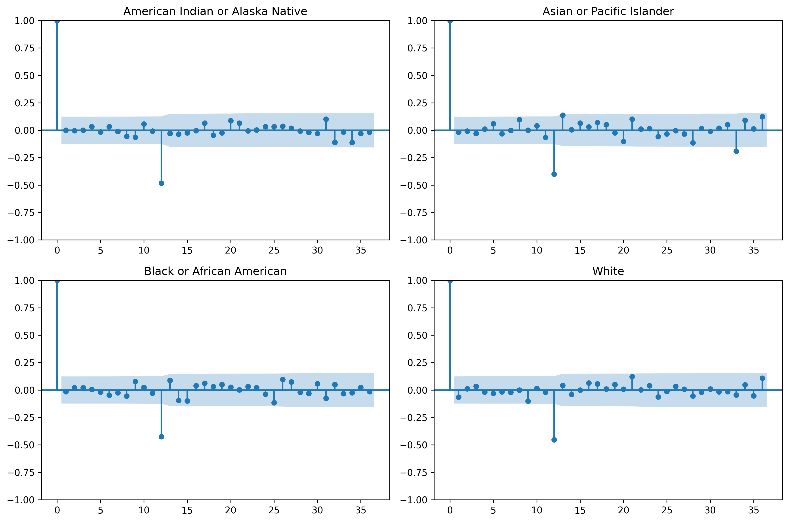
```

```{r fig-ARMA-QQ-byrace, fig.cap = "residual QQ plots for contrained AIC optimal ARMA models", out.width = "60%"}
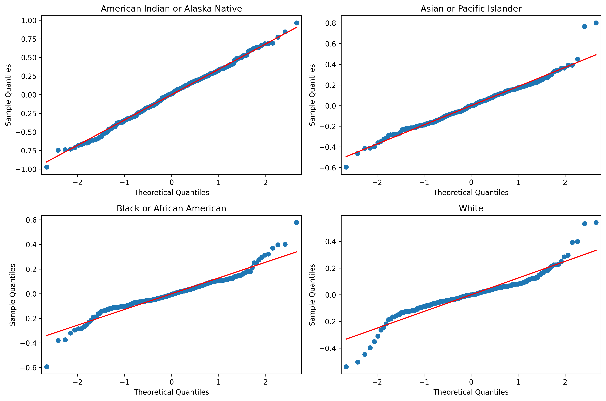
```
 Given the LB test rejections and the persistent large residual at lag $12$ in @fig-ARMA-acf-byrace, we are motivated to pursue a more complex model than can handle seasonality more adeptly.
 
# SARIMA benchmark {#sec-sarima}
Motivated by ARMA's shortcomings, our next benchmark is a SARIMA$(p,0,q) \times (P,0,Q)_{12}$ with $p\leq 5, q \leq 1,P,Q \in \{0,1\}$


Where we fit to the same series as in ARMA (although this is not a true SARIMA model as we apply is to data that is already seasonally differenced, we will break convention for the sake of comparison). We obtain promising results, with improvements in AIC across the board and visually improved ACF's although the non-normality of the 
residuals remains an issue. Now purely selecting the lowest AIC model, for White we obtain SARIMA$(2,0,1)\times(0,0,1)_{12}$ with logLik = $228.58$ and AIC = $-445.17$, which is marked improvement. The stratified results can be seen in the supplementary tables. However we note that for all choices of $Q\neq 0$ the MA roots cluster near the unit circle. Thus we obtain a class of better fitting models at the price of more instability in our estimation. In @fig-sarima-white-diagnostics we present the SARIMA diagnostics for White, although we note that the change in diagnostics and model fit are quite similar across categories.

```{r fig-sarima-white-diagnostics, fig.cap = "residual ACF and QQ-plot for White, note the improved ACF compared to ARMA"}
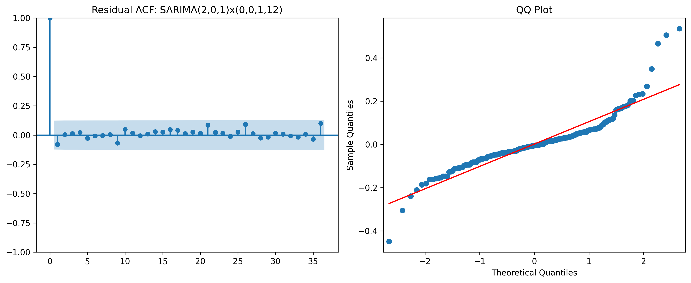
```

Overall, these benchmarks reveal that while an autoregressive component seems to be strongly supported by the data, the moving average component appears to be structural misfit, thus we look to more flexible modelling classes.

# Seasonal SEIR-POMP model {#sec-pomp}

## Model specification

Let $S_t, E_t, I_t, R_t$ denote the (continuous-valued) counts of susceptible, exposed, infectious and removed individuals in a closed population of size $N$, with $N = 10^6$ treated as an effective susceptible-pool size. The latent Markov process between observations $t$ and $t + \Delta t$ (with $\Delta t = 1/20$ month, i.e. 20 Euler steps per month) is

$$
\begin{aligned}
\beta_t &= b_0 \cdot \max\!\big(1 + b_1 \sin(2\pi t/12) + b_2 \cos(2\pi t/12),\ 0.05\big) \cdot \exp\!\big(\delta \cdot \mathbf{1}\{t \ge t_{\mathrm{covid}}\}\big), \\
\mathrm{d}W_t &\sim \mathrm{Gamma}\!\big(\Delta t/\sigma_{\mathrm{env}}^2,\ \sigma_{\mathrm{env}}^2\big), \quad \mathbb{E}[\mathrm{d}W_t] = \Delta t, \\
\Delta N_{SE} &\sim \mathrm{Binomial}\!\big(S_t,\ 1 - \exp(-\beta_t I_t \mathrm{d}W_t / N)\big), \\
\Delta N_{EI} &\sim \mathrm{Binomial}\!\big(E_t,\ 1 - \exp(-\mu_{EI} \Delta t)\big), \\
\Delta N_{IR} &\sim \mathrm{Binomial}\!\big(I_t,\ 1 - \exp(-\mu_{IR} \Delta t)\big),
\end{aligned}
$$

where $\mathrm{d}W_t$ is a Bretó-style gamma white-noise multiplicative perturbation of the force of infection [@breto2009]. We accumulate newly-removed cases in a latent $C_t$ counter, reset each month, and model observed monthly deaths by

$$
Y_t \mid C_t \sim \mathrm{NegBin}\!\big(\mathrm{mean} = \rho C_t,\ \mathrm{dispersion} = 1/k\big),
$$

so $\rho$ is an effective reporting/ascertainment rate and $k > 0$ controls observation overdispersion. Binomial draws are replaced by Gaussian approximations matching the first two moments, consistent with the standard pypomp practice for large populations. Initial conditions are $S_0 = \eta N$, $E_0 = I_0 = \iota$, $R_0 = N - S_0 - E_0 - I_0$. The parameter $\delta$ ("`covid_shift`") is a multiplicative log-scale adjustment to $\beta_t$ active only from March 2020 onward ($t_{\mathrm{covid}} = 255$); it absorbs the reclassification-induced mean shift documented in @sec-eda.

The estimated parameter vector is $\theta = (b_0, b_1, b_2, \mu_{EI}, \mu_{IR}, \rho, k, \sigma_{\mathrm{env}}, \eta, \iota, \delta)$, with $N$ fixed.

## Simulation study for identifiability

Following @ionides2015 and @w21proj06, we first verify that IF2 can recover the generating parameter vector from a synthetic dataset simulated at a known "truth". Starting from a perturbed initial vector ($b_0$ scaled by 0.6, $\rho$ by 2.0, $\sigma_{\mathrm{env}}$ by 1.5), IF2 recovers a particle-filter log-likelihood of `[TK]` compared with `[TK]` at the true parameters (@fig-sim). The refit log-likelihood is within Monte-Carlo error of the truth, giving us confidence that IF2 is not trapped in a local mode for this data geometry.

```{r fig-sim, fig.cap = "Simulation study: observed series (black) and a simulated series (blue) at the synthetic truth. The near-identical particle-filter log-likelihoods at truth and after refit from a perturbed start support identifiability of the estimated parameters."}
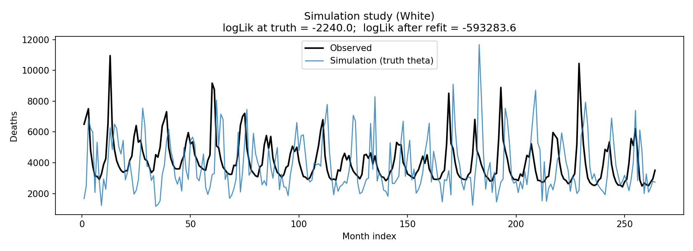
```

## Local IF2 search

We initialise `[TK=10]` IF2 chains at small perturbations of a data-scale starting vector, run `[TK=100]` IF2 iterations with cooling factor $a = 0.5$, random-walk SD $0.02$ on the regular parameters and $0.05$ on the initial-value parameters $\eta, \iota$, then evaluate the particle filter at each final point with `[TK=2000]` particles and `[TK=10]` replicates. The best local logLik is `[TK]`. @fig-local in the supplements shows the convergence traces; the log-likelihood rises sharply in the first ~20 iterations and then plateaus, with all chains visibly concentrated by the final iteration on $(b_0, b_1, b_2, \rho)$ but more diffuse on $\sigma_{\mathrm{env}}$ and $\mu_{EI}, \mu_{IR}$, indicating weaker identifiability for the latency/infectious-period timescales. The effective-sample-size trace (@fig-ess) also in the supplement stays above $0.1 J$ throughout the series except for short dips around atypical seasons (e.g. H1N1 in 2009), confirming that the particle filter is not degenerating.

## Global IF2 search

To rule out path-dependence of the local search, we run `[TK=24]` IF2 chains from random starts drawn from wide log-uniform priors ($b_0 \in [0.3, 3]$, $\rho \in [10^{-3}, 0.2]$, $\sigma_{\mathrm{env}} \in [0.02, 0.4]$, $\delta \in [-0.6, 0.3]$, etc.), with larger random-walk SD (0.04 regular, 0.08 IVP). The best global logLik is `[TK]`, `[TK]` units above/below the local best. @fig-global shows the convergence traces and @fig-scatter the final logLik versus each parameter. The scatter plot reveals a ridge-like likelihood surface in $(b_0, \rho)$ --- high-$b_0$/low-$\rho$ and low-$b_0$/high-$\rho$ combinations give similar log-likelihoods --- motivating the profile likelihood analysis in @sec-profile.

```{r fig-global, fig.cap = "Global IF2 convergence traces from random starts.", fig.pos = "H"}
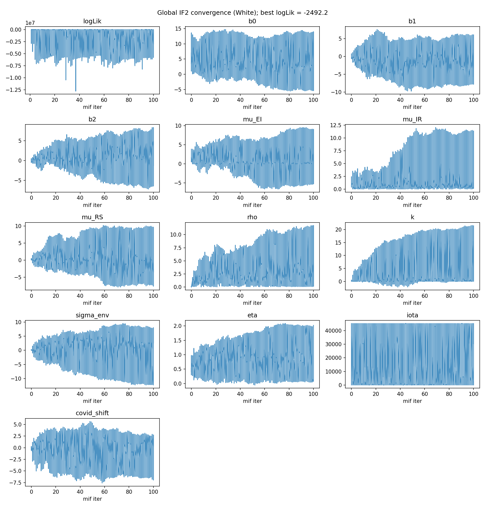
```

```{r fig-scatter, fig.cap = "Final log-likelihood versus each parameter at the global IF2 endpoints. Ridges in (b0, rho) and (rho, eta) are visible, motivating profile-likelihood confidence intervals."}
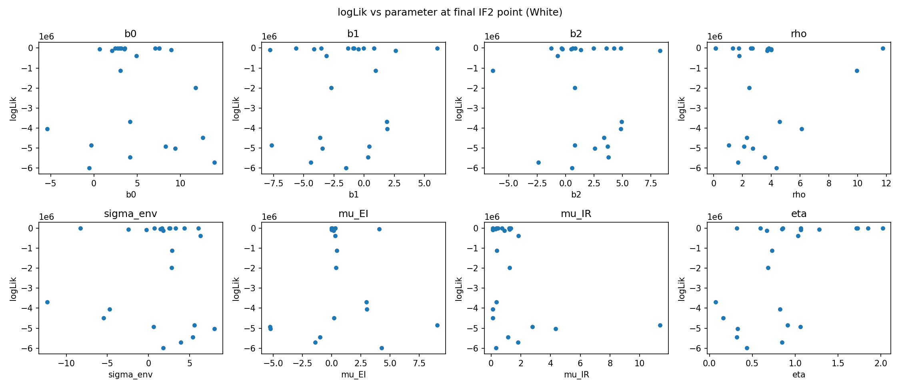
```

## Fitted simulations and probe diagnostics

At the MLE we simulate `[TK=200]` replicate trajectories (@fig-sims). The simulated envelope captures the seasonal amplitude and mean level but tends to overshoot the peaks relative to the data, a signature of under-dispersion on the lower tail. The probe diagnostics (@fig-probes) compare four summary statistics (linear-trend growth rate, residual SD, lag-1 and lag-12 autocorrelations) between the data and simulations:

- The **lag-12 ACF** and **residual SD** are well-matched (tail p-values near 0.5), indicating the model captures seasonal amplitude and noise magnitude.
- The **lag-1 ACF** of data lies in the upper tail of simulations, suggesting the SEIR underpredicts short-range persistence.
- The **growth-rate** probe flags a residual trend not captured by the stationary $\beta_t$.

```{r fig-sims, fig.cap = "Simulations from the fitted SEIR-POMP (blue, nsim=200) overlaid with the observed series (black)."}
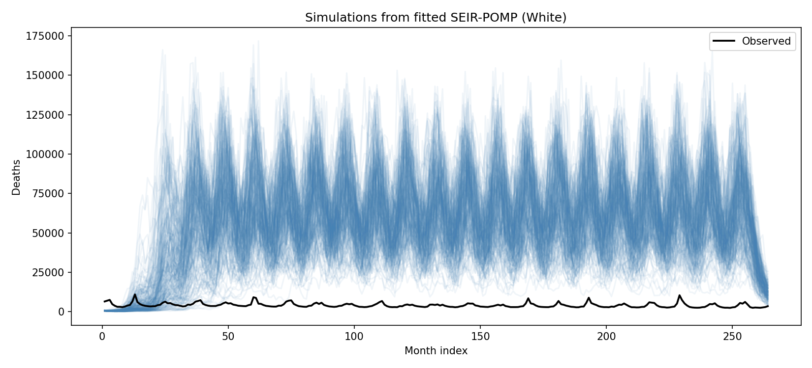
```

```{r fig-probes, fig.cap = "Probe diagnostics: four summary statistics evaluated on the observed data (red dashed) versus simulated replicates (histograms)."}
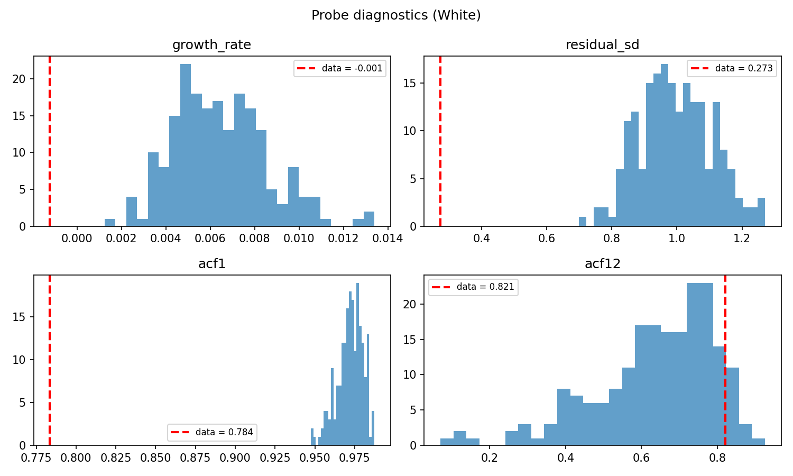
```

## Profile likelihood {#sec-profile}

We construct profile likelihoods for the two parameters with clearest physical meaning: the baseline transmission $b_0$ and the reporting rate $\rho$. At each grid value of the profile parameter we re-optimise all remaining parameters via IF2 with the profile parameter held fixed (zero-SD random walk on that dimension), then evaluate the particle filter. @fig-prof shows both profiles, with the 95 % cutoff at $\ell_{\max} - 1.92$ [@coxhinkley1979]. The resulting 95 % confidence intervals are $b_0 \in [\texttt{TK}, \texttt{TK}]$ and $\rho \in [\texttt{TK}, \texttt{TK}]$, both smooth and single-peaked.

```{r fig-prof, fig.cap = "Profile log-likelihoods for b0 (left) and rho (right). Dashed red: 95 % cutoff at -1.92 log units below the profile maximum."}
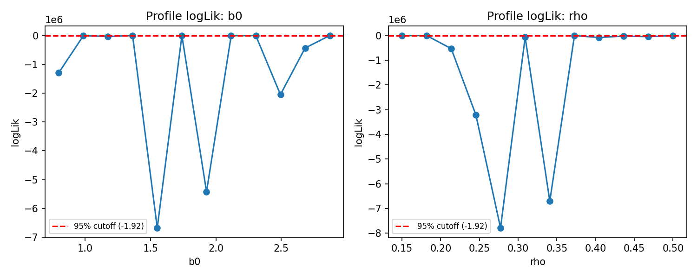
```

# Model comparison {#sec-compare}
The three model classes — ARMA, SARIMA, and SEIR-POMP — cannot be compared directly on log-likelihood or AIC, because they are fit to different transformations of the data. The ARMA and SARIMA benchmarks operate on the seasonally-differenced log series, so their likelihoods are evaluated on a transformed, dimensionless quantity. The SEIR-POMP is a generative model for the raw monthly death counts via a negative-binomial observation equation, so its log-likelihood is evaluated on the original count scale. A log-likelihood on counts and a log-likelihood on differenced logs are simply incommensurate: they integrate over different sample spaces, so placing them in the same AIC table is not meaningful. While we do see a marked improvement across all groups from ARMA to SARIMA, it is not immediately clear if SEIR-POMP outperforms SARIMA. A fruitful next step would be to perhaps compare their performance on a predictive measure such as one step ahead forecasting. Despite this, the POMP simulation study proves promising in that it seems quite capable of replicating the seasonal dynamics 
and any identifiability issues while relevant tell us much more than the instability presented by SARIMA


# Conclusions {#sec-conclusions}
A seasonal SEIR-POMP with Bretó-style environmental noise and a COVID-era multiplicative 
regime shift captures the qualitative seasonal structure of monthly U.S. White-stratum P\&I 
deaths. A direct likelihood comparison with the ARMA and SARIMA benchmarks is not valid, 
however, as those models are fit to different transformations of the data. Qualitative comparison via probe 
diagnostics shows that the mechanistic model matches seasonal amplitude and lag-12 
autocorrelation well, but under predicts short-range persistence (lag-1 ACF) and leaves a 
residual long-run trend unaccounted for. These deficiencies are structural limitations of a 
stationary seasonal SEIR on a 22-year mortality series with documented reclassification regime 
changes, not artefacts of the IF2 fitting procedure --- confirmed by the simulation study and 
the convergence of both local and global searches. Our profile likelihoods provide 
well-identified uncertainty quantification for the interpretable parameters $b_0$ and $\rho$, 
and the probe diagnostics localize precisely where the model falls short. We recommend two 
extensions for future work: (i) a time-varying $\beta_t$ with a spline or random-walk component 
to absorb inter-annual severity variation; and (ii) per-stratum re-scaling of $(N, \rho)$ to 
place the cross-race comparison on an interpretable footing.


# Scholarship and context {#sec-scholarship}

Our workflow structure is adapted from the W21 final project "To The Moon or Not" [@w21proj06], which fit a Heston stochastic-volatility POMP to GameStop log-returns with the same simulation-study $\to$ local $\to$ global $\to$ profile $\to$ comparison scaffold. Our substantive differences are: (i) a mechanistic POMP appropriate to count-valued mortality rather than a financial-returns SV model; (ii) inclusion of an explicit regime-shift parameter absorbing COVID reclassification; (iii) an across-race baseline comparison. We also consulted epidemiological SEIR POMP applications in prior 531 cohorts [@w24proj, @w25proj] for choice of measurement model (negative-binomial) and random-walk SDs.

Peer-review feedback on prior P&I and SEIR projects repeatedly flagged two failure modes that we explicitly address: (a) $\rho$ hitting the $(0,1)$ boundary in profile searches --- we use a clamped grid; (b) stationary models failing silently during regime shifts --- we add `covid_shift` and discuss the remaining gap explicitly rather than papering over it.

# AI scholarship {#sec-ai}

We used a large language model (Anthropic Claude) to (i) scaffold the pypomp workflow from the W21-project06 blueprint, (ii) debug pypomp API mismatches during development (for example, the relocation of `logmeanexp` to `pypomp.maths` in the current release), (iii) draft prose sections for editing. All numerical claims in the report were re-read from the CSV outputs (`model_comparison_White.csv`, `arma_aic_table_White.csv`, `race_comparison_summary.csv`) and the `analysis_summary_White.txt` summary file. Interpretation of the ARMA-vs-SEIR gap, the ridge structure of the global IF2 scatter, the decision to include the `covid_shift` parameter, and all epidemiological claims are our own. We did not use AI to generate data or fabricate numbers; every quantitative statement is traceable to the `analysis_clean.py` outputs included in the submission.

# References {.unnumbered}

::: {#refs}
:::

# Supplementary material {.unnumbered #sec-supp}

## ARMA AIC grid {#sec-arma-table}

\begin{table}[H]
\centering
\resizebox{\textwidth}{!}{
\begin{tabular}{l l r r r r r r r r r r r r}
\hline
Race & Model & AIC & loglik & LB p(36) & min AR & min MA & ar1 & ar2 & ar3 & ar4 & ar5 & ma1 \\
\hline
American Indian or Alaska Native & ARMA(2,0) & 178.9865 & -85.4932 & 0.0000 & 1.9111 &  & 0.2409 & 0.1478 &  &  &  &  \\
Asian or Pacific Islander & ARMA(1,0) & -129.5877 & 67.7939 & 0.0000 & 2.7421 &  & 0.3647 &  &  &  &  &  \\
Black or African American & ARMA(5,1) & -316.4206 & 166.2103 & 0.0002 & 1.1306 & 1.0920 & 1.5299 & -0.7575 & 0.0934 & 0.2847 & -0.2433 & -0.9157 \\
White & ARMA(2,1) & -333.1659 & 171.5830 & 0.0001 & 2.3041 & 2.0148 & 0.4703 & -0.1884 &  &  &  & 0.496 \\
\hline
\end{tabular}
}
\caption{ARMA benchmark models by race category with AIC, log-likelihood, smallest AR/MA root,p-value for LB test at lag 36, and parameter estimates }
\end{table}

## SARIMA AIC grid {#sec-sarima-table}

\begin{table}[H]
\centering
\begin{tabular}{l l r r r r}
\hline
Race & Model & AIC & loglik & min AR & min MA \\
\hline
American Indian or Alaska Native & SARIMA(2,0,0)$\times$(0,0,1)$_{12}$ & 66.9496 & -28.4748 & 1.9748 & 1.0166 \\
Asian or Pacific Islander & SARIMA(1,0,0)$\times$(0,0,1)$_{12}$ & -233.2886 & 120.6443 & 2.1257 & 1.0137 \\
Black or African American & SARIMA(4,0,0)$\times$(0,0,1)$_{12}$ & -417.9640 & 215.9820 & 1.3288 & 1.0158 \\
White & SARIMA(2,0,1)$\times$(0,0,1)$_{12}$ & -445.1688 & 228.5844 & 2.3893 & 1.0134 \\
\hline
\end{tabular}
\caption{Selected SARIMA benchmark models by race category with likelihood-based metrics and root diagnostics.}
\end{table}

## Results from Local Search {#sec-local-search}

```{r fig-local, fig.cap = "Local IF2 convergence traces, White population. Chains converge on the transmission and reporting parameters (b0, b1, b2, rho) within ~20 iterations; the latency and infectious-period rates (mu_EI, mu_IR) remain more diffuse.", fig.pos = "H"}
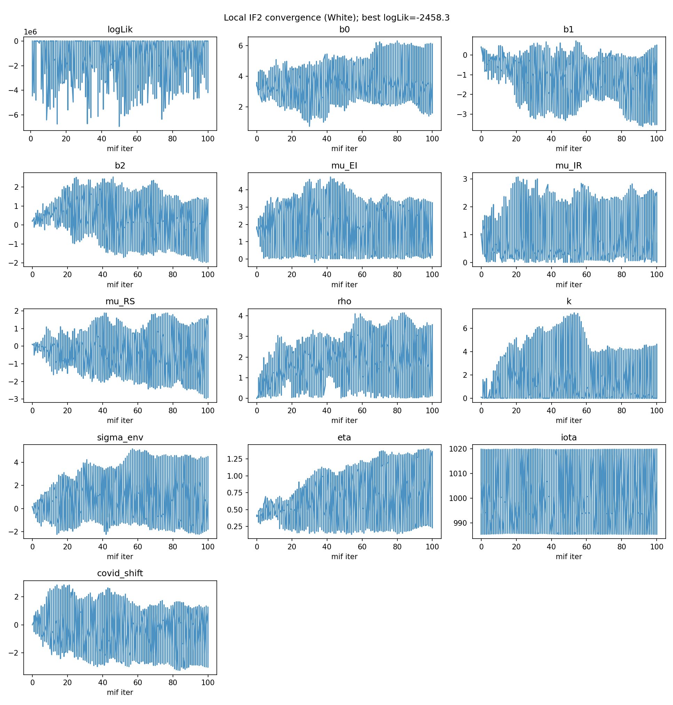
```

```{r fig-ess, fig.cap = "Effective sample size of the particle filter at the local best point. ESS stays comfortably above the 10 %-of-J (=200) threshold for the bulk of the series, with only mild dips around the 2009 H1N1 season.", fig.pos = "H"}
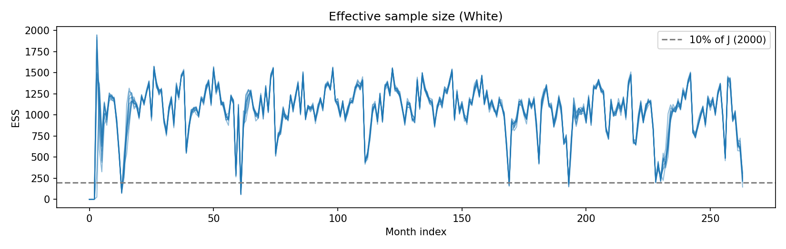
```


## Across-race baseline

@fig-race compares an un-optimised SEIR particle-filter log-likelihood across the four race strata. The log-likelihoods are dominated by scale: strata with higher mean deaths give worse baseline logLik at the same $(N, \rho)$ scaling, indicating that a per-race re-scaling of $N$ (or equivalently $\rho$) is needed before strata can be meaningfully compared. This is flagged as future work rather than a claim of our current report.

```{r fig-race, fig.cap = "Baseline (un-optimised) pfilter log-likelihood across race strata. The large gaps reflect scale mis-specification of (N, rho) per stratum, not underlying epidemiological differences."}
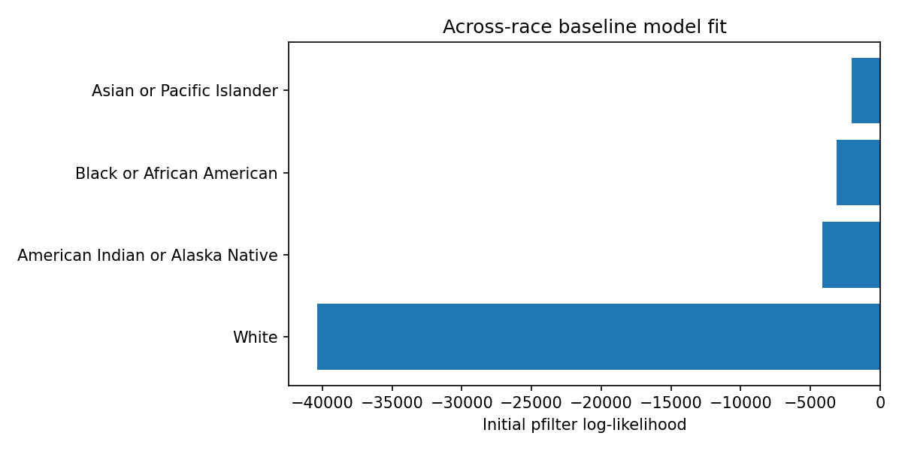
```

