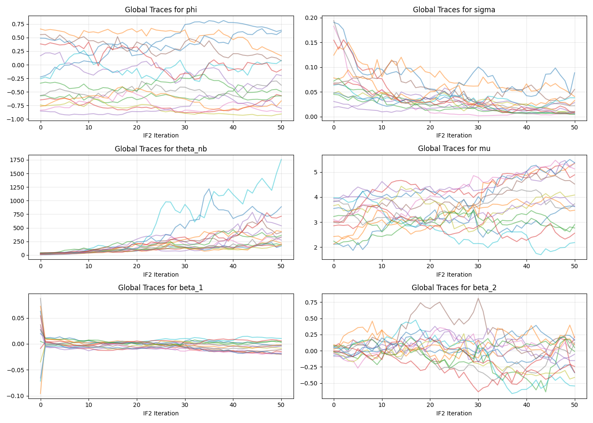
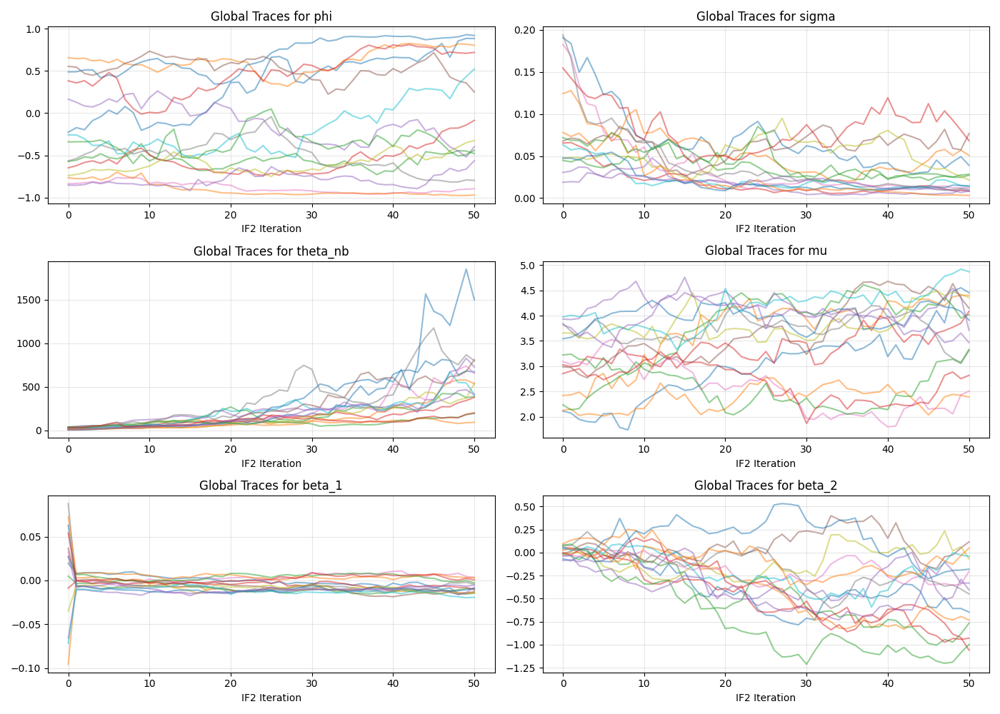
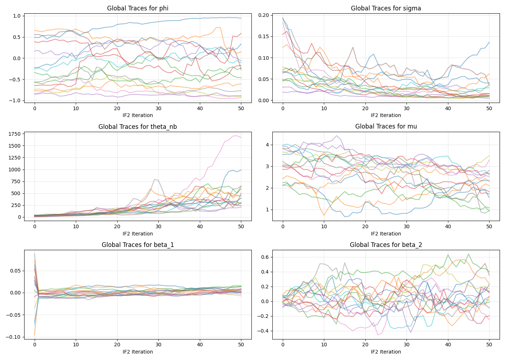

# Introduction and Motivation

Basketball is often described as a game of runs, meaning that each team will go on a run where they score several points in a row, mutliple times a game. On an individual level, players are thought to have hot streaks, where they perform better than usual for a small period of time, in-game or across them. This is referred to as "having a hot hand" or on a longer scale, ["a linsanity run"](https://www.youtube.com/watch?v=N3VpaRX0uus). Inspired by a past project that modeled baseball team momentum as a POMP model [@pastprojbaseball], this project aims to model the hot hand phenomenon in basketball using a similar POMP modeling approach. It will answer the question:

<div style="text-align: center;">
**Is there statistical evidence for the hot hand phenomenon across games in basketball?**
</div>

As stated in the previous project, baseball has the distinct advantage of more data points and a simpler game structure to model, unlike basketball, which has more factors influencing the outcome of a game, and fewer observations. However, basketball has the advantage of players having more stable within-game performances, as they usually play most of the game and have a lot of chances to score. This higher volume of invovlement helps reduce variability and noise at the game level, making it feasible to model the hot hand phenomenon based on observable statistics, like points.

# Data Description and Exploration

We decided to intially focus on the MVP (Most Valuable Player) of the 2024-25 NBA season, Shai Gilgeous-Alexander (SGA). Data was collected from the 'nba_api' Python package [@nbaapi], which provides easy access to a wide range of NBA statistics. We extracted game logs for SGA's season, including both regular season and playoff games. For each game, we collected the following variables:

- **Points (PTS)**: The number of points SGA scored in the game, which serves as our primary measure of performance and our observed variable.
- **Rolling Defensive Rating**: A centered two-week rolling average, leading up to the game, of the opponent's defensive rating, which estimates the number of points the opponent allows per 100 possessions. This serves as a covariate to account for the ability of the opponent to stop scoring. *Note: Due to the rolling nature of this variable, the first few games of the season will have less data points in the calculation, and thus may be less accurate. Similarly, in the playoffs when the teams play each other multiple times in a row, the rating might be influenced by the games played against SGA himself, which is a limitation to consider.*
- **Home/Away Indicator**: A binary variable indicating whether the game was played at home (1) or away (0), which accounts for the home-court advantage that can influence player performance.
- **Usage % Missing**: Usage % measures how often a player ends a possession or shoots the ball relative to the rest of the players on the court [@usagerate]. We calculated the missing usage % for each game, which is the difference between the total usage % of SGA's team, subset to only players who averaged 12 minutes a game (a quarter) or more, and the usage % of the active players in that game. Usage % is related to a player's scoring behavior, so it could be another endogenous variable, but calculated over a season, it should be mostly exogenous to the player's hotness in a given game. This variable accounts for the fact that in some games, SGA might have more or less opportunity to score based on the availability of his teammates.

These are indexed by game number instead of game date, which is usually around every 2-3 days, but can be more or less frequent depending on the schedule. This is done to get a clean time series for modeling, but it is important to note that the time gaps between games are not uniform, and could be a factor in the player's performance and hotness. For example, a longer gap between games could lead to rustiness, while a shorter gap could lead to fatigue. Gaps long enough to cause significant changes in the player's performance are few and far between, but they could still be an interesting area for future exploration.

```{python}
#| echo: false
#| eval: false

import pandas as pd
import time
import numpy as np
from nba_api.stats.static import players, teams
from nba_api.stats.endpoints import playergamelog, leaguedashteamstats, leaguedashplayerstats, boxscoretraditionalv3

player_name = "Jayson Tatum"
season = "2021-22"
team_abrv = "BOS"

player_id = players.find_players_by_full_name(player_name)[0]['id']

# Extracts every game log for player for the specified season 
for season_type in ["Regular Season", "Playoffs"]:
    gamelog = playergamelog.PlayerGameLog(player_id=player_id, season=season, season_type_all_star=season_type)
    gamelog_df = gamelog.get_data_frames()[0]
    gamelog_df['GameType'] = season_type
    if season_type == "Regular Season":
        regular_season_df = gamelog_df
    else:
        playoffs_df = gamelog_df

final_df = pd.concat([regular_season_df, playoffs_df], ignore_index=True)

# Extract opponent team from MATCHUP column
final_df['Opponent'] = final_df['MATCHUP'].str[-3:]

# Change data to right format
final_df.GAME_DATE = pd.to_datetime(final_df.GAME_DATE)
final_df.sort_values('GAME_DATE', inplace=True)

team_name_to_abbrev = {
    "Atlanta Hawks": "ATL",
    "Boston Celtics": "BOS",
    "Brooklyn Nets": "BKN",
    "Charlotte Hornets": "CHA",
    "Chicago Bulls": "CHI",
    "Cleveland Cavaliers": "CLE",
    "Dallas Mavericks": "DAL",
    "Denver Nuggets": "DEN",
    "Detroit Pistons": "DET",
    "Golden State Warriors": "GSW",
    "Houston Rockets": "HOU",
    "Indiana Pacers": "IND",
    "LA Clippers": "LAC",
    "Los Angeles Lakers": "LAL",
    "Memphis Grizzlies": "MEM",
    "Miami Heat": "MIA",
    "Milwaukee Bucks": "MIL",
    "Minnesota Timberwolves": "MIN",
    "New Orleans Pelicans": "NOP",
    "New York Knicks": "NYK",
    "Oklahoma City Thunder": "OKC",
    "Orlando Magic": "ORL",
    "Philadelphia 76ers": "PHI",
    "Phoenix Suns": "PHX",
    "Portland Trail Blazers": "POR",
    "Sacramento Kings": "SAC",
    "San Antonio Spurs": "SAS",
    "Toronto Raptors": "TOR",
    "Utah Jazz": "UTA",
    "Washington Wizards": "WAS"
}

# Produces two week rolling defensive rating for each opponent

for date, opponent, GameType in zip(final_df['GAME_DATE'], final_df['Opponent'], final_df['GameType']):
    try:
        two_weeks_prior = date - pd.Timedelta(days=15)
        df_rolling = leaguedashteamstats.LeagueDashTeamStats(
            season = season,
            season_type_all_star= GameType,
            measure_type_detailed_defense= "Advanced",
            per_mode_detailed= "PerGame",
            date_from_nullable = two_weeks_prior.strftime('%Y-%m-%d'),
            date_to_nullable = (date - pd.Timedelta(days=1)).strftime('%Y-%m-%d')
        ).get_data_frames()[0]
        df_rolling['Team'] = df_rolling['TEAM_NAME'].map(team_name_to_abbrev)
        match = df_rolling.loc[df_rolling['Team'] == opponent, 'DEF_RATING']
        rating = match.iloc[0] if not match.empty else np.nan
        final_df.loc[(final_df['GAME_DATE'] == date) & (final_df['Opponent'] == opponent),'Rolling_DEF_RATING']= rating
        time.sleep(1)
        print(f"Processed {date} vs {opponent}")
    except:
        print(f"Error processing {date} vs {opponent}")

# Get team ID
team_info = teams.get_teams()
team_info = next(team for team in team_info if team['abbreviation'] == team_abrv)
team_id = team_info['id'] 

# Get team usage rates for the whole season
df_usage = leaguedashplayerstats.LeagueDashPlayerStats(
    season = season,
    season_type_all_star= "Regular Season",
    team_id_nullable= team_id,
    per_mode_detailed= "PerGame",
    measure_type_detailed_defense = "Advanced"
).get_data_frames()[0]

team_usage = df_usage[['PLAYER_NAME', 'PLAYER_ID', 'MIN', 'USG_PCT']]
team_usage = team_usage[team_usage['MIN'] > 12].drop(columns=['MIN']) # Filter out players with less than 12 minutes per game to focus on regular contributors
max_team_usage = team_usage.USG_PCT.sum() # Get total usage of other players

games = final_df.Game_ID.unique()
results = []

for i, game_id in enumerate(games):
    boxscore = boxscoretraditionalv3.BoxScoreTraditionalV3(game_id = game_id).get_data_frames()[0]
    team_boxscore = boxscore[boxscore['teamId'] == team_id]
    usage_boxscore = team_boxscore.merge(team_usage, left_on='personId', right_on='PLAYER_ID', how='left')
    usage_boxscore['USG_PCT'] = usage_boxscore['USG_PCT'].fillna(0) # Fill NaN usage rates with 0 for players not qualified
    usage_boxscore['Active'] = (usage_boxscore.comment == '') | (usage_boxscore.comment == 'DNP - Coach\'s Decision') # Consider players active if they played or were listed as DNP-Coach's Decision
    usage_active = (usage_boxscore.Active * usage_boxscore.USG_PCT).sum()
    results.append({
        'Game_ID': game_id,
        'Usage_Missing': max_team_usage - usage_active
    })
    time.sleep(1)
    print(f"Processed game {i}")

usage_df = pd.DataFrame(results)

final_df = final_df.merge(usage_df, on='Game_ID', how='left')

final_df['Usage_Missing'] = np.where(final_df['Usage_Missing'] < 1e-12, 0, final_df['Usage_Missing']) # Set small missing usage to 0

final_df['home'] = final_df['MATCHUP'].str.contains('vs.').astype(int)

final_df = final_df[['GAME_DATE', 'PTS', 'Rolling_DEF_RATING', 'Usage_Missing', 'home']]
final_df.to_csv(f'{player_name.replace(" ", "_")}_data.csv', index=False)
```

@fig-pts shows the our observed variable, points scored, over the course of the season.

```{python}
#| fig-align: center
#| label: fig-pts
#| fig-cap: "Points scored by SGA in the 2024-25 season, including regular season and playoffs."

import pandas as pd
import matplotlib.pyplot as plt
import statsmodels.api as sm
df = pd.read_csv('Shai_Gilgeous-Alexander_data.csv')
data_point_no = df.shape[0]

plt.plot(df['PTS'])
plt.ylabel('Points')
plt.xlabel('Game Number')
plt.title('Shai Gilgeous-Alexander Points Over Time')
plt.tight_layout()
```

`{python} data_point_no` data points corresponding to games played for SGA in the 2024-25 season, at an average of `{python} f"{df.PTS.mean():.2f}"` points per game. Admittedly, this is less than the 100 data points asked for, but it is close enough to where our diagnostics and approximations should still be valid.


# ARMA Modeling

Since @fig-pts above does not show any clear violations of stationarity, we can start by creating a benchmark ARMA model that would model the points scored as an ARMA process, without any covariates or latent states. This would give us a baseline to compare our POMP model to. The ARMA model is specified as:

$$\phi(B)((1-B)P_t -\mu) = \theta(B)\epsilon_t, \quad \epsilon_t \sim N(0, \sigma^2)$$

where $B$ is the backshift operator, $\phi(B)$ and $\theta(B)$ are polynomials of order $p$ and $q$ respectively, and $\mu$ is the mean of the process [@notes531]. 

```{python}
arma_model = sm.tsa.arima.ARIMA(df.PTS, order=(4,0,4), trend = 'c').fit()
log_lik = arma_model.llf
```

An AIC table over different values of $p$ and $q$ is shown in @tbl-aic in the Supplementary Materials, which suggests that a ARMA(4,4) model is the best fit for the data. This is somewhat surprising given the small number of data points, but it could be due to the fact that the points scored in a game can be influenced by a variety of factors, creating complex relationships in the data.

The ARMA(4,4) model gives us a log-likelihood of `{python} f"{log_lik:.2f}"`, which we will use as a benchmark to compare our POMP model to. The parameters of the ARMA(4,4) model and the ACF plot for the residuals is shown in @fig-acf in the Supplementary Materials.

# POMP Modeling

## Model Specification

The latent state $X_t$ represents the player's hotness in a given game, which is an unobserved variable that captures the player's underlying performance level that can fluctuate from game to game. We model this latent state as an AR(1) process,  [@pastprojbaseball]:

$$X_t = \phi X_{t-1} + \epsilon_t, \quad \epsilon_t \sim N(0, \sigma^2)$$

The process thus has the following transition density:

$$f_{X_t|X_{t-1}}(x_t|x_{t-1}) = \frac{1}{\sqrt{2\pi\sigma^2}} \exp\left(-\frac{(x_t - \phi x_{t-1})^2}{2\sigma^2}\right)$$

The observations $P_t$ represent the points scored in a game, which we model as Poisson, as the simplest way to model count data, but negative binomial will be another option considered later:

$$P_t|X_t \sim \text{Poisson}(\lambda_t) $$

The rate parameter $\lambda_t$ is modeled as a log-linear function of the latent state $X_t$ and the covariates, which allows us to capture the effect of the player's hotness and the other factors on the points scored:
$$\lambda_t = \exp(\mu + X_t + \beta_1 R_t + \beta_2 H_t + \beta_3 M_t)$$

where $R_t$ is the centered rolling opponent's defensive rating, $H_t$ is the home indicator variable, and $M_t$ is the usage % missing in that game. Just like our predecessors in the baseball project [@pastprojbaseball], we include the $\mu$ term to capture the baseline scoring level of the player, for which $\exp(\mu)$ can be interpreted as the expected points scored when the player is at neutral hotness ($X_t = 0$), against an average opponent ($R_t = 0$), playing without the home court boost ($H_t = 0$), and with nobody missing from the lineup ($M_t = 0$).

We would expect $\beta_1$ to be negative, as a higher defensive rating implies worse defense and thus more points scored, $\beta_2$ to be positive, as playing at home usually gives a boost to performance, and $\beta_3$ to be positive, as having more missing usage % means that the player has more opportunity to score. We can assume that the player starts the season at a neutral hotness level, so we can set $X_0 = 0$ for the initial state.

```{python}
import pypomp as pp
import jax
import jax.numpy as jnp
import pandas as pd
import numpy as np

df = df[['PTS', 'Rolling_DEF_RATING', 'home', 'Usage_Missing']]

ys = df[['PTS']].copy()

covars = df[[ 'Rolling_DEF_RATING', 'home', 'Usage_Missing']].copy()
covars['DF_centered'] = (covars['Rolling_DEF_RATING'] - np.mean(covars['Rolling_DEF_RATING']))/np.std(covars['Rolling_DEF_RATING'])

def rinit(theta_, key, covars = None, t0 = 0):
    return {"X": 0.0}

def rproc(X_, theta_, key, covars, t, dt):
    X_prev = X_["X"]
    phi = theta_["phi"]
    sigma = theta_["sigma"]

    key, subkey = jax.random.split(key)
    X_new = phi * X_prev + sigma * jax.random.normal(subkey)
    return {"X": X_new}

def dmeas(Y_, X_, theta_, covars, t = None):
    y_t = Y_["PTS"]
    x_t = X_["X"]
    beta_1 = theta_["beta_1"]
    beta_2 = theta_["beta_2"]
    beta_3 = theta_["beta_3"]
    mu = theta_["mu"]

    r_t = covars["DF_centered"]
    h_t = covars["home"]
    m_t = covars["Usage_Missing"]

    lambda_t =  jnp.exp(mu + x_t + beta_1 * r_t + beta_2 * h_t + beta_3 * m_t)
    return jax.scipy.stats.poisson.logpmf(y_t, lambda_t)

def rmeas(theta_, X_, key, covars, t = None):
    x_t = X_["X"]
    beta_1 = theta_["beta_1"]
    beta_2 = theta_["beta_2"]
    beta_3 = theta_["beta_3"]
    mu = theta_["mu"]

    r_t = covars["DF_centered"]
    h_t = covars["home"]
    m_t = covars["Usage_Missing"]

    lambda_t = jnp.exp(mu + x_t + beta_1 * r_t + beta_2 * h_t + beta_3 * m_t)
    key, subkey = jax.random.split(key)
    y = pp.random.fast_approx_rpoisson(subkey, lambda_t)
    return jnp.array([y])

def to_est(theta):
    return {
        "phi": theta["phi"],
        "sigma": jnp.log(theta["sigma"]),
        "beta_1": theta["beta_1"],
        "beta_2": theta["beta_2"],
        "beta_3": theta["beta_3"],
        "mu": theta["mu"]
    }

def from_est(theta):
    return {
        "phi": theta["phi"],
        "sigma": jnp.exp(theta["sigma"]),
        "beta_1": theta["beta_1"],
        "beta_2": theta["beta_2"],
        "beta_3": theta["beta_3"],
        "mu": theta["mu"]
    }

par_trans = pp.ParTrans(to_est = to_est, from_est = from_est)

params = {
    "phi": 0.8,
    "sigma": 0.05,
    "beta_1": -0.01,
    "beta_2": 0.1,
    "beta_3": 0.01,
    "mu": 3.3
}

pomp_model = pp.Pomp(
    ys = ys,
    t0 = 0,
    rinit = rinit,
    rproc = rproc,
    dmeas = dmeas,
    rmeas = rmeas,
    theta = params,
    covars = covars,
    statenames = ["X"],
    nstep = 1,
    ydim = 1,
    par_trans=par_trans
)
```

## Local Search

We will start searching around the following initial parameter values:

- *$\phi = 0.8$*: This suggests a fairly persistent hotness state.
- *$\sigma = 0.05$*: This suggests that the hotness state does not fluctuate too wildly from game to game.
- *$\mu = 3.4$*: This is the baseline scoring level, which corresponds to about $e^{3.4} \approx 30$ points per game, around SGA's average points per game.
- *$\beta_1 = -0.1$*: This suggests that a one standard deviation increase in the opponent's defensive rating would lead to about a 10% ($e^{-0.1} \approx 0.9$) decrease in points scored. For Shai, this would mean that playing against a top defensive team would lead to about 6 points less scored. 
- $\beta_2 = 0.05$: This suggests that playing at home would lead to about a 5% ($e^{0.05} \approx 1.05$) increase in points scored. Star players are largely unaffected by this home court boost, but it could still be a factor.
- $\beta_3 = 0.2$: This suggests that a 1% increase in missing usage would lead to about a 20% ($e^{0.2} \approx 1.22$) increase in points scored, which is quite significant, and suggests that the player's opportunity to score is a major factor in his performance.

Some simulations from this model with initial parameters are shown in @fig-sims.
```{python}
#| fig-align: center
#| label: fig-sims
#| fig-cap: "Simulated points scored from the POMP model with initial parameters, compared to observed points."
_, sims = pomp_model.simulate(theta = params, nsim = 20, key= jax.random.key(67))
sims_df = sims.pivot_table(index = "time", columns = "sim", values = "obs_0")

plt.figure(figsize=(8,4))
plt.plot(ys.index, ys['PTS'], label='Observed Points', color = "red")
for sim in sims_df.columns:
    plt.plot(sims_df.index, sims_df[sim], color = "blue", alpha=0.3)
plt.legend()
plt.show()

key = jax.random.key(68)
pomp_model.pfilter(key = key, J = 500, reps = 1)
result = pomp_model.results_history.last()
loglik = float(result.logLiks.values[0, 0])
```

```{python}
#| echo: false

cache_dir = "cache"
import os
import pickle
os.makedirs(cache_dir, exist_ok=True)

rw_sd = pp.RWSigma(
    sigmas={
        "phi": 0.02,
        "sigma": 0.01,
        "beta_1": 0.02,
        "beta_2": 0.02,
        "beta_3": 0.02,
        "mu": 0.1
    },
)
cache_file = cache_dir + "/local-search.pkl"
if os.path.exists(cache_file):
    with open(cache_file, 'rb') as f:
        ll_local = pickle.load(f)
else:
    import jax.scipy.special as jspecial
    pomp_model.mif(J=4000, M=500, rw_sd=rw_sd, a=0.5, key=jax.random.PRNGKey(123))
    pomp_model.pfilter(J=1000, key=jax.random.PRNGKey(456), CLL=True)
    ll_local = float(pomp_model.results_history[-1].CLL.sum(dim="time").values.item())
    with open(cache_file, 'wb') as f:
        pickle.dump(ll_local, f)
```

The log-likelihood of the model with the initial parameters is `{python} f"{loglik:.2f}"`. If we search around these parameters using a local search [@githubcode] we get a maximum log-likelihood of `{python} f"{ll_local:.2f}"`, which is an improvement over the intial parameters, but still worse than the ARMA model. 


## Global Search

Implementing a global search [@githubcode] across different starting parameters is crucial to ensure we are not just stuck in a local maximum, which increases our chances of finding a true maximum.  We search across the following ranges:

- $\phi$: [0.01, 0.99]
- $\sigma$: [0.01, 0.2]
- $\beta_1$: [-0.5, 0]
- $\beta_2$: [0, 0.5]
- $\beta_3$: [0, 0.5]
- $\mu$: [2.5, 4.0]


```{python}
cache_file = cache_dir + "/global-search.pkl"

rw_sd = pp.RWSigma(
    sigmas={
        "phi": 0.02,
        "sigma": 0.01,
        "beta_1": 0.02,
        "beta_2": 0.02,
        "beta_3": 0.02,
        "mu": 0.1
    },
)

if os.path.exists(cache_file):
    with open(cache_file, 'rb') as f:
        results_df = pickle.load(f)
else:
    np.random.seed(2062379496)
    n_starts = 50
    theta_list = []
    for i in range(n_starts):
        th = params.copy()
        th["phi"] = np.random.uniform(0.01, 0.99)
        th["sigma"] = np.random.uniform(0.01, 0.2)
        th["beta_1"] = np.random.uniform(-0.5, 0)
        th["beta_2"] = np.random.uniform(0, 0.5)
        th["beta_3"] = np.random.uniform(0, 0.5)
        th["mu"] = np.random.uniform(2.5, 4.0)
        theta_list.append(th)

    mod = pp.Pomp(
        rinit=rinit, rproc=rproc,
        dmeas=dmeas, rmeas=rmeas,
        ys=ys, theta=theta_list,
        statenames=['X'],
        par_trans=par_trans,
        nstep=1, t0 = 0.0,
        ydim=1, covars=covars
    )
    key = jax.random.key(1270401374)
    mod.mif(J=2000, M=50,
            rw_sd=rw_sd, a=0.5, key=key)
    key = jax.random.key(1270401375)
    mod.mif(J=2000, M=100,
            rw_sd=rw_sd, a=0.5, key=key)

    key = jax.random.key(1270401376)
    mod.pfilter(key=key, J=5000, reps=10)
    pf = mod.results_history.last()

    rows = []
    for i in range(n_starts):
        lls = pf.logLiks.values[i, :]
        rows.append({
            **mod.theta[i],
            'loglik': pp.logmeanexp(lls),
            'loglik_se': pp.logmeanexp_se(lls)
        })
    results_df = pd.DataFrame(rows)
    results_df = results_df[
        np.isfinite(results_df['loglik'])]
    with open(cache_file, 'wb') as f:
        pickle.dump(results_df, f)
```

The best likelihood found across is `{python} f"{results_df['loglik'].max():.1f}"`, which is actually worse than the local search, which suggests that the local search might have found a better maximum, or that the global search did not explore the parameter space effectively. We can show the results of the global search in @fig-global:

```{python}
#| fig-align: center
#| label: fig-global
#| fig-cap: "Results of global search across different starting parameters."
#| echo: false
fig, axes = plt.subplots(3, 2)
pairs = [
    ("phi", "loglik"),
    ("sigma", "loglik"),
    ("beta_1", "loglik"),
    ("beta_2", "loglik"),
    ("beta_3", "loglik"),
    ("mu", "loglik"),
]
for ax, (x, y) in zip(axes.flat, pairs):
    ax.scatter(results_df[x], results_df[y],
        s=10, alpha=0.7)
    ax.set(xlabel=x, ylabel=y)
    ax.grid(alpha=0.3)
plt.tight_layout()
plt.show()
```

This seems to indicate that $\phi$ values are generally negative for better likelihoods, which is counterintuitive, as it would suggest that a higher hotness in the previous game would lead to a lower hotness in the current game. This may be because the model is misspecified and the latent state is capturing some other factor that has a negative relationship with points scored. Either way, we can expand to searches executed on the Great Lakes cluster. We can also implement a Negative Binomial measurement model, which adds an additional dispersion parameter $\theta_{nb}$ to account for overdispersion in the points scored, which is common in basketball due to the varying point values of different shot types (free throws, 2-pointers, and 3-pointers). The formula for this model is:

$$P_t|X_t \sim \text{NegativeBinomial}(\lambda_t, \theta_{nb})$$

where $\lambda_t$ is the same log-linear function of the latent state and covariates, and $\theta_{nb}$ is the dispersion parameter.

We generated multiple random starting points for our parameters: the autoregressive coefficient ($\phi$), the latent state noise ($\sigma$), the covariate coefficients ($\beta_1, \beta_2, \beta_3$), the baseline scoring rate ($\mu$) and the Negative Binomial dispersion parameter ($\theta_{nb}$). For each starting point, we ran the `mif` algorithm to filter the particles and converge on the MLE. The parameter set that yielded the highest maximized log-likelihood after filtering was selected as the global MLE for each player.

### Convergence Diagnostics: Global Search Trace Plots

To verify the convergence of our IF2 algorithm, we examined the parameter trace plots from our global search. The plots below display the trajectories of 15 randomly initialized starting points over the course of the filtering iterations for each player. 

Despite the parameters being initialized across a wide and highly variable parameter space, the algorithm successfully forces the disparate starting points to converge toward consensus values. 



### Measurement Model Comparison: Poisson vs. Negative Binomial

To determine the best measurement model for our POMP architecture, we evaluated both a standard Poisson distribution and a Negative Binomial distribution.

By extracting the MLE from our IF2 global search for both models, we can directly compare their goodness-of-fit:

| Player | Poisson MLE Log-Likelihood | Negative Binomial MLE Log-Likelihood |
| :--- | :--- | :--- |
| **Shai Gilgeous-Alexander** | -355.24 | -352.63 |
| **Steph Curry** | -569.26 | -518.03 |
| **Jayson Tatum** | -780.32 | -377.37 |

For all three players, the Negative Binomial model yields a higher maximum log-likelihood. The improvement is particularly drastic for Jayson Tatum and Steph Curry, high-volume 3-point shooters whose game-to-game scoring variance is heavily influenced by perimeter shooting percentages. Another crucial point is that this log-likelihood is less than the one achieved by our local search with the Poisson model for Shai, 


## $\phi$ Profiling

To directly test for the presence of the "hot hand" phenomenon, we constructed a profile likelihood for the autoregressive parameter, $\phi$. In our model formulation, $\phi$ dictates the persistence of the latent state $X_t$. A value of $\phi$ significantly greater than zero would indicate that a player's underlying "hot" or "cold" state carries over from game to game, providing mathematical evidence for the hot hand. 

We evaluated the profile likelihood across a grid of fixed $\phi$ values. For each fixed value, we re-ran the iterated filtering process to maximize the likelihood over all other parameters. 

```{python}
#| label: profile-likelihood-nb-results
#| echo: false
#| message: false
#| fig-cap: "Profile Likelihood of the 'Hot Hand' parameter (phi) across three players using a Negative Binomial measurement model."

import pandas as pd
import matplotlib.pyplot as plt
import os

players = {
    "Shai Gilgeous-Alexander": "Shai_Gilgeous-Alexander_nb_profile.csv",
    "Steph Curry": "Steph_Curry_nb_profile.csv",
    "Jayson Tatum": "Jayson_Tatum_nb_profile.csv"
}

plt.figure(figsize=(10, 6))
colors = {"Shai Gilgeous-Alexander": "blue", "Steph Curry": "goldenrod", "Jayson Tatum": "green"}

for player_name, filename in players.items():
    if os.path.exists(filename):
        df = pd.read_csv(filename)

        plt.plot(df['phi'], df['loglik'], marker='o', label=player_name, color=colors[player_name])

        cutoff = df['cutoff'].iloc[0]
        plt.axhline(y=cutoff, color=colors[player_name], linestyle='--', alpha=0.6)

plt.title("Negative Binomial Profile Likelihood: Does the 'Hot Hand' Exist?")
plt.xlabel("Autoregressive Parameter ($\phi$)")
plt.ylabel("Maximized Log-Likelihood")
plt.legend()
plt.grid(alpha=0.3)
plt.tight_layout()
plt.show()
```


# Conclusion

In this project, we aimed to rigorously quantify the "hot hand" phenomenon in the NBA by modeling player scoring as a Partially Observed Markov Process (POMP). By treating a player's underlying "form" or "momentum" as a hidden latent state driven by an autoregressive process, we attempted to separate true psychological momentum from standard statistical variance and external covariates (such as opponent defensive ratings and home-court advantage). 

We used a **Negative Binomial measurement model** to explicitly account for overdispersion in basketball scoring (which naturally arises due to the varying point values of free throws, 2-pointers, and 3-pointers), as it proved to perform better than a Poisson measurement model across all three players. Though it is important to note than an ARMA(4,4) still outperformed our POMP models in terms of log-likelihood, suggesting that there is room for improvement in our model specification.

## Discussion of Findings

Based on our $\phi$ profiling using the Negative Binomial model, the data does not provide strong statistical evidence for a sustained "hot hand" effect that carries over from game to game. 

For all three players (Shai Gilgeous-Alexander, Steph Curry, and Jayson Tatum), the profile likelihood surface is highly irregular, and the maximized log-likelihoods for the fixed $\phi$ values completely fail to cross the 95% confidence interval threshold derived from the global Maximum Likelihood Estimate. This suggests two main conclusions:

1. **Weak Latent Signal:** The variation in a player's game-to-game scoring is likely dominated by the measurement model, specifically the Negative Binomial overdispersion and the observable covariates, rather than a persistent, hidden autoregressive state. Even for historically explosive scorers like Curry, the model struggles to identify a consistent $\phi$ signal.
2. **Optimization Challenges:** The steep drop-off between the global MLE and the profile likelihood points indicates a highly jagged likelihood surface. 

## Future Work and Limitations

Outside of the limitation of time heterogeneity between games, and data restraints, the key limitation of this project is that there are many hidden factors that could be influencing the player's performance that may be currently absorbed into the latent state. For example, if a player gets hot, a defense will adjust their scheme to try to stop him, leading to less points scored in the next game. It would be nice to expand the model to account for some of these factors, potentially adding in game factors like shot distribution, but it would require more data. Future work could also explore modeling the hot hand phenomenon within games, as there are more points and a clearer time structure, but it would require a more complex model to account for all the different factors.

# Scholarship and Acknowledgements

## Contextual Integration

This project builds on work and review comments from the past midterm projects [@pastprojbaseball], [@pastprojbasketball]. Our project was inspired by the future work suggestion from the baseball project, suggesting applying their work to individual momentum. Our modeling approach was similar to theirs, and we used their WAR suggestion to represent availability, and put it into related basketball context in *Missing Usage %*. Lastly, something echoed in both review comments was a desire to run on multiple teams, which in our case was on players. We implemented this to get a sense of whether our results are consistent across different players.

## AI Usage

AI was primarily used for debugging code, especially helpful in the data extraction section, where we had to deal with a lot of API calls and data manipulation. The core modeling and analysis was done by us, with the help of class notes, past projects, and any citations mentioned.

# Bibliography

::: {#refs}
:::

# Supplementary Materials

AIC table for ARMA models with different values of $p$ and $q$:

```{python}
#| label: tbl-aic
P,Q = 5,5
table = np.zeros((P+1,Q+1))
for p in range(P+1):
    for q in range(Q+1):
        try:
            model = sm.tsa.arima.ARIMA(df.PTS, order=(p,0,q), trend = 'c').fit()
            table[p,q] = round(model.aic, 2)
        except:
            table[p,q] = np.nan
        

display_table = pd.DataFrame(table, index = [f'AR{p}' for p in range(P+1)], columns = [f'MA{q}' for q in range(Q+1)])

display_table
```

Fitting this model with 4 AR and 4 MA terms gives us the following parameters:

```{python}
print(arma_model.summary())
```

ACF plot for residuals of ARMA(4,4) model:

```{python}
#| fig-align: center
#| label: fig-acf
#| fig-cap: "ACF plot for residuals of ARMA(4,4) model."
from statsmodels.graphics.tsaplots import plot_acf
residuals = arma_model.resid
plot_acf(residuals, lags=20)
plt.title('ACF of ARMA(4,4) Residuals')
plt.show()
```

The following code was used on the Great Lakes cluster to perform the global Maximum Likelihood Estimation and the profile likelihood generation:

```{python}
#| eval: false
#| echo: true

import pandas as pd
import numpy as np
import jax
import jax.numpy as jnp
import jax.scipy.special as jspecial
import pypomp as pp
from pypomp import RWSigma
import matplotlib.pyplot as plt
import gc
import os

def rproc(X_, theta_, key, covars, t, dt):
    X_new = theta_["phi"] * X_["X"] + theta_["sigma"] * jax.random.normal(key)
    return {"X": X_new}

def dmeas(Y_, X_, theta_, covars, t):
    lam = jnp.exp(theta_["mu"] + X_["X"] + 
                  theta_["beta_1"] * covars["Rolling_DEF_RATING"] + 
                  theta_["beta_2"] * covars["Usage_Missing"] + 
                  theta_["beta_3"] * covars["home"])
    
    n = theta_["theta_nb"]
    p = n / (n + lam)
    
    return jax.scipy.stats.nbinom.logpmf(Y_["PTS"], n, p)

def rmeas(X_, theta_, key, covars, t):
    lam = jnp.exp(theta_["mu"] + X_["X"] + 
                  theta_["beta_1"] * covars["Rolling_DEF_RATING"] + 
                  theta_["beta_2"] * covars["Usage_Missing"] + 
                  theta_["beta_3"] * covars["home"])
    
    n = theta_["theta_nb"]
    key1, key2 = jax.random.split(key)
    gamma_sample = jax.random.gamma(key1, n)
    rate = gamma_sample * (lam / n)
    
    return jnp.array([jax.random.poisson(key2, rate)])

rinit = lambda theta_, key, covars, t0: {"X": 0.0}

def to_est(theta):

    phi_mapped = (theta["phi"] + 1.0) / 2.0
    return {"phi": jspecial.logit(phi_mapped), "sigma": jnp.log(theta["sigma"]), 
            "theta_nb": jnp.log(theta["theta_nb"]),  
            "beta_1": theta["beta_1"], "beta_2": theta["beta_2"], "beta_3": theta["beta_3"], "mu": theta["mu"]}

def from_est(theta_est):

    phi_unmapped = 2.0 * jspecial.expit(theta_est["phi"]) - 1.0
    return {"phi": phi_unmapped, "sigma": jnp.exp(theta_est["sigma"]), 
            "theta_nb": jnp.exp(theta_est["theta_nb"]),
            "beta_1": theta_est["beta_1"], "beta_2": theta_est["beta_2"], "beta_3": theta_est["beta_3"], "mu": theta_est["mu"]}

par_trans = pp.ParTrans(to_est=to_est, from_est=from_est)

players = [
    "Shai_Gilgeous-Alexander_data.csv", 
    "Steph_Curry_data.csv", 
    "Jayson_Tatum_data.csv"
]

for player_file in players:
    player_name = player_file.split('_data')[0]
    print(f"\nStarting Negative Binomial Analysis for {player_name}")
    
    try:
        df = pd.read_csv(player_file)
    except FileNotFoundError:
        print(f"Could not find {player_file}, skipping...")
        continue
        
    ys = df[['PTS']]
    covars = df[['Rolling_DEF_RATING', 'Usage_Missing', 'home']]
    
    # Global Search Setup
    n_starts = 15
    np.random.seed(42)
    global_starts = [{
        "phi": np.random.uniform(-0.9, 0.9), "sigma": np.random.uniform(0.01, 0.2),
        "theta_nb": np.random.uniform(5.0, 50.0), 
        "beta_1": np.random.uniform(-0.1, 0.1), "beta_2": np.random.uniform(-0.1, 0.1),
        "beta_3": np.random.uniform(-0.1, 0.1), "mu": np.random.uniform(2.0, 4.0)
    } for _ in range(n_starts)]

    global_pomp = pp.Pomp(ys=ys, t0=0, rinit=rinit, rproc=rproc, dmeas=dmeas, rmeas=rmeas, 
                          theta=global_starts, covars=covars, statenames=["X"], nstep=1, par_trans=par_trans)
    
    rw_sd = RWSigma(sigmas={"phi": 0.02, "sigma": 0.02, "theta_nb": 0.02, 
                            "beta_1": 0.01, "beta_2": 0.01, "beta_3": 0.01, "mu": 0.02})
    
    print("Running Global Search")
    global_pomp.mif(J=1500, M=50, rw_sd=rw_sd, a=0.95, key=jax.random.PRNGKey(789))
    global_pomp.pfilter(J=2500, reps=5, key=jax.random.PRNGKey(1011), CLL=True)

    pf_result = global_pomp.results_history[-1]
    df_cll = pf_result.CLL().reset_index()
    
    val_col = df_cll.select_dtypes(include=['float']).columns[0]
    cat_cols = df_cll.select_dtypes(exclude=['float']).columns
    
    theta_col = [c for c in cat_cols if 'theta' in c.lower() or df_cll[c].nunique() == n_starts][0]
    rep_col = [c for c in cat_cols if 'rep' in c.lower() or df_cll[c].nunique() == 5][0]
    
    summed_over_time = df_cll.groupby([theta_col, rep_col])[val_col].sum().reset_index()
    
    def lse(x):
        return float(jspecial.logsumexp(x.values) - jnp.log(5))
        
    mean_ll = summed_over_time.groupby(theta_col)[val_col].apply(lse)
    
    best_idx = int(mean_ll.idxmax())
    best_loglik = float(mean_ll.max())
    
    mif_results = global_pomp.results_history[-2].traces_da
    actual_params = ["phi", "sigma", "theta_nb", "beta_1", "beta_2", "beta_3", "mu"]
    best_params = {param: float(mif_results.isel(theta_idx=best_idx, iteration=-1).sel(variable=param).values) 
                   for param in actual_params}
                   
    print(f"MLE LogLik: {best_loglik:.2f}")

    print("Generating Global Trace Plots")
    params_to_plot = ["phi", "sigma", "theta_nb", "mu", "beta_1", "beta_2"]
    fig, axes = plt.subplots(3, 2, figsize=(14, 10))
    for idx, param in enumerate(params_to_plot):
        ax = axes[idx // 2, idx % 2]
        for start_idx in range(mif_results.sizes['theta_idx']):
            trace_vals = mif_results.isel(theta_idx=start_idx).sel(variable=param).values.flatten()
            ax.plot(trace_vals, alpha=0.5)
        ax.set_title(f"Global Traces for {param}")
        ax.set_xlabel("IF2 Iteration")
        ax.grid(alpha=0.3)

    plt.tight_layout()
    trace_filename = f"global_traces_{player_name}.png"
    plt.savefig(trace_filename)
    print(f"Saved {trace_filename}")
    plt.close()

    print("Running Profile Likelihood for phi (-0.99 to 0.99)")
    phi_vals = np.linspace(-0.99, 0.99, 30)
    profile_results = []
    
    rw_sd_prof = RWSigma(sigmas={"phi": 0.0, "sigma": 0.02, "theta_nb": 0.02, 
                                 "beta_1": 0.01, "beta_2": 0.01, "beta_3": 0.01, "mu": 0.02}, init_names=["sigma"])

    for p_val in phi_vals:
        prof_starts = [{**best_params, "phi": p_val} for _ in range(5)]
        prof_pomp = pp.Pomp(ys=ys, t0=0, rinit=rinit, rproc=rproc, dmeas=dmeas, rmeas=rmeas, 
                            theta=prof_starts, covars=covars, statenames=["X"], nstep=1, par_trans=par_trans)
        
        prof_pomp.mif(J=1500, M=50, rw_sd=rw_sd_prof, a=0.95, key=jax.random.PRNGKey(333))
        prof_pomp.pfilter(J=2500, key=jax.random.PRNGKey(444), reps=5, CLL=True)
        
        prof_df = prof_pomp.results_history[-1].CLL().reset_index()
        prof_val_col = prof_df.select_dtypes(include=['float']).columns[0]
        prof_cat_cols = prof_df.select_dtypes(exclude=['float']).columns
        
        prof_rep_col = [c for c in prof_cat_cols if 'rep' in c.lower() or prof_df[c].nunique() == 5][0]
        
        prof_ll_per_rep = prof_df.groupby(prof_rep_col)[prof_val_col].sum().values
        prof_mean_ll = float(jspecial.logsumexp(prof_ll_per_rep) - jnp.log(5))
        
        profile_results.append({"phi": p_val, "loglik": prof_mean_ll, "cutoff": best_loglik - 1.92})
        
        del prof_pomp
        gc.collect()

    pd.DataFrame(profile_results).to_csv(f"{player_name}_nb_profile.csv", index=False)
    print(f"Saved {player_name}_nb_profile.csv")

print("All processing complete!")
```

Trace Plots from the Global Search for each player:



